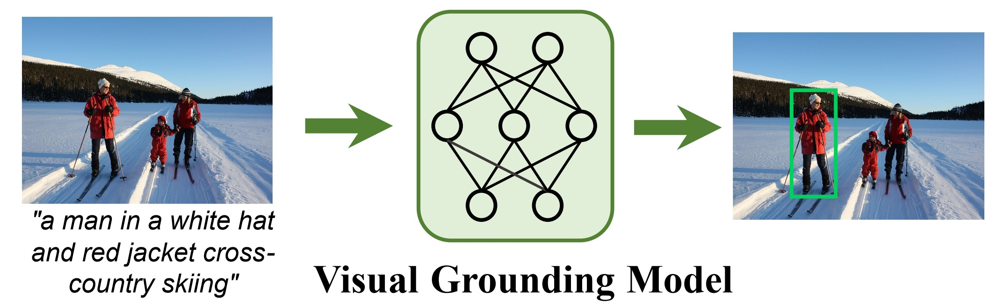
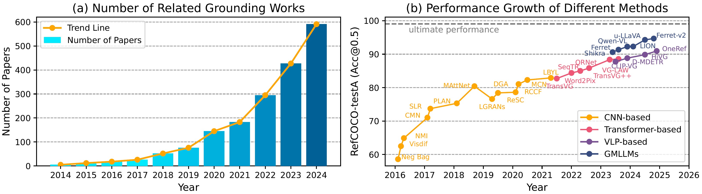
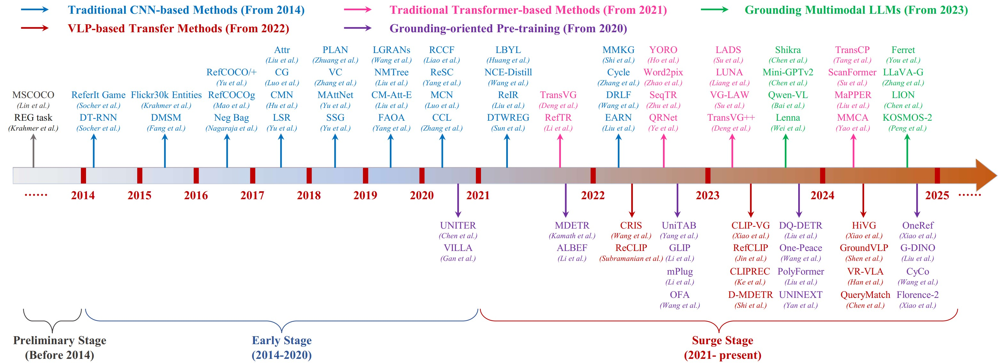
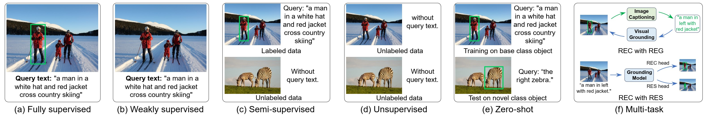
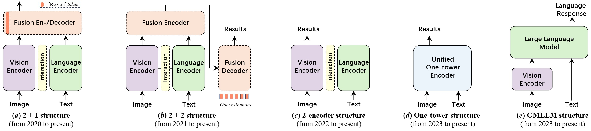
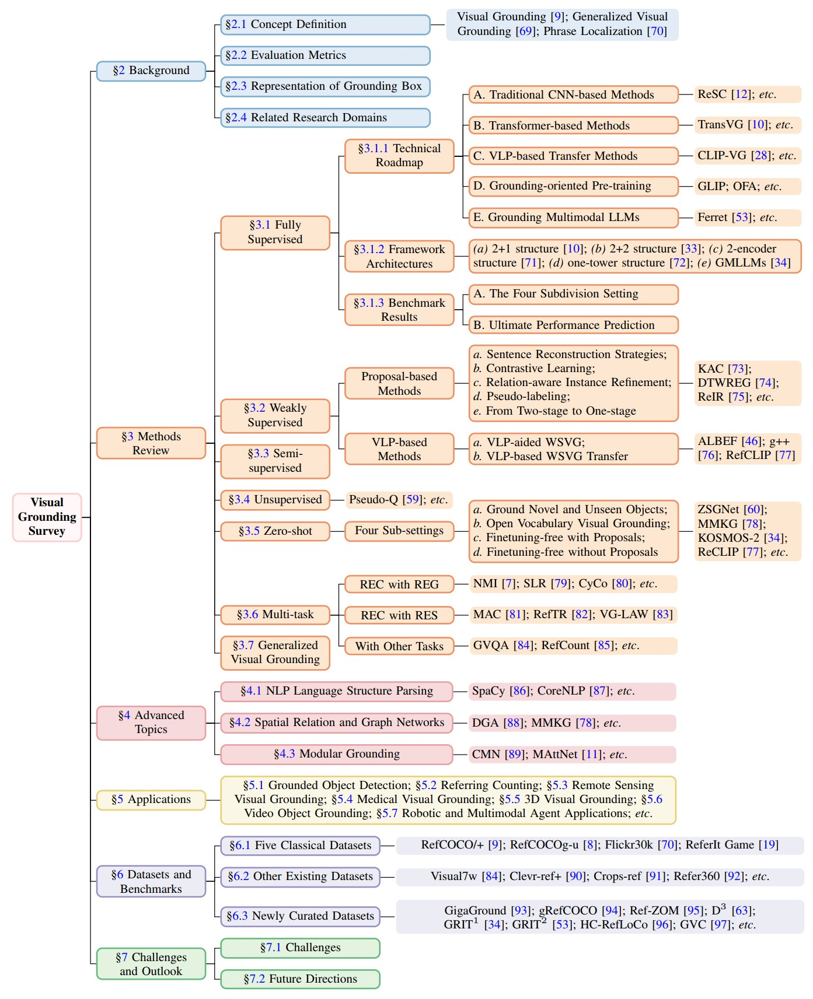

[](https://github.com/sindresorhus/awesome)
[](https://github.com/linhuixiao/Awesome-Visual-Grounding/pulls)
<br />
<p align="center">
  <h1 align="center">Towards Visual Grounding: A Survey</h1>
  <p align="center">
    <b> TPAMI under review, 2024 </b>
    <br />
    <a href="https://scholar.google.com.hk/citations?user=4rTE4ogAAAAJ&hl=zh-CN&oi=sra"><strong> Linhui Xiao </strong></a>
    ·
    <a href="https://yangxs.ac.cn/home"><strong>Xiaoshan Yang </strong></a>
    ·
    <a href="https://scholar.google.com.hk/citations?user=c3iwWRcAAAAJ&hl=zh-CN&oi=ao"><strong>Xiangyuan Lan </strong></a>
    ·
    <a href="https://scholar.google.com.hk/citations?user=o_DllmIAAAAJ&hl=zh-CN"><strong>Yaowei Wang </strong></a>
    ·
    <a href="https://scholar.google.com.hk/citations?user=hI9NRDkAAAAJ&hl=zh-CN"><strong>Changsheng Xu</strong></a>
  </p>
  <p align="center">
    <a href='https://arxiv.org/abs/2412.20206'>
      
    </a>
<br />

[//]: # "    <a href='https://ieeexplore.ieee.org/document/10420487'>"
[//]: # "      "
[//]: # "    </a>"
[//]: # "  </p>"

<p align="center">  </p>

**<p align="center"> An Illustration of Visual Grounding  </p>**


<p align="center">  </p>

**<p align="center"> A Decade of Visual Grounding </p>**

This repo is used for recording, tracking, and benchmarking several recent visual grounding methods to supplement our [Grounding Survey](https://arxiv.org/pdf/2412.20206). 

<h3 align="left">
Links: <a href="https://arxiv.org/abs/2412.20206">ArXiv</a>,
<a href="https://mp.weixin.qq.com/s/I0SNcv9RypSV5Fp9sh4bLQ">《机器之心》中文解读</a>
</h3>

**Please leave a <font color='orange'>STAR ⭐</font> if you like this project!**

### 🔥 Add Your Paper in our Repo and Survey!

- If you find any work missing or have any suggestions (papers, implementations, and other resources), feel free to [pull requests](https://github.com/linhuixiao/Awesome-Visual-Grounding/pulls).
We will add the missing papers to this repo as soon as possible.

- You are welcome to give us an issue or PR (pull request) for your visual grounding related works!

- **Note that:** Due to the huge paper in Arxiv, we are sorry to cover all in our survey. **You can directly present a PR into this repo** and we will record it for next version update of our survey.


### 🔥 New

- 🔥🔥🔥 **Our Grounding survey has been accepted by TPAMI on October 30, 2025 !!!**

- 🔥 **We made our survey paper public and created this repository on** **December 28, 2024**.

- **Our advanced one-tower grounding work OneRef ([Paper](https://openreview.net/pdf?id=siPdcro6uD), [Code](https://github.com/linhuixiao/OneRef)) has been accepted by top conference NeurIPS 2024 in October 2024!**

- **Our advanced grounding work HiVG ([Paper](https://openreview.net/pdf?id=NMMyGy1kKZ), [Code](https://github.com/linhuixiao/HiVG)) has been accepted by top conference ACM MM 2024 in July 2024!**

- **Our grounding work CLIP-VG ([Paper](https://arxiv.org/pdf/2305.08685), [Code](https://github.com/linhuixiao/CLIP-VG)) has been accepted by top journal TMM in September 2023!**


### 🔥 Highlight!!

- A comprehensive survey for Visual Grounding, including Referring Expression Comprehension and Phrase Grounding.

- It includes the newly concepts, such as Grounding Multi-modal LLMs, Generalized Visual Grounding, and VLP-based grounding transfer works. 

- We list detailed results for the most representative works and give a fairer and clearer comparison of different approaches.

- We provide a list of future research insights.


# Introduction

**We are the first survey in the past five years to systematically track and summarize the development of visual 
grounding over the last decade.** By extracting common technical details, this review encompasses the most representative
work in each subtopic. 

**This survey is also currently the most comprehensive review in the field of visual grounding.** We aim for this article 
to serve as a valuable resource not only for beginners seeking an introduction to grounding but also for researchers 
with an established foundation, enabling them to navigate and stay up-to-date with the latest advancements.


<p align="center">  </p>

**<p align="center"> A Decade of Visual Grounding  </p>**

<p align="center">  </p>

**<p align="center"> Mainstream Settings in Visual Grounding  </p>**

<p align="center">  </p>

**<p align="center">  Typical Framework Architectures for Visual Grounding  </p>**

<p align="center">  </p>

**<p align="center"> Our Paper Structure  </p>**


## Citation

If you find our work helpful for your research, please consider citing the following BibTeX entry.   

```bibtex
@misc{xiao2024visualgroundingsurvey,
      title={Towards Visual Grounding: A Survey}, 
      author={Linhui Xiao and Xiaoshan Yang and Xiangyuan Lan and Yaowei Wang and Changsheng Xu},
      year={2024},
      eprint={2412.20206},
      archivePrefix={arXiv},
      primaryClass={cs.CV},
      url={https://arxiv.org/abs/2412.20206}, 
}
```
**It should be noted that**, due to the typesetting restrictions of the journal, there are small differences in the 
typesetting between the Arxiv version and review version.

**The following will be the relevant grounding papers and associated code links in this paper:**

# Summary of Contents
This content corresponds to the main text.


[//]: # "超链接的语法：默认:,.等符号直接忽略，空格“ ”用“-”代替，“-”继续用“-”"

- [Introduction](#introduction)
  - [Citation](#citation)
- [Summary of Contents](#summary-of-contents)
- [1. Methods: A Survey](#1-methods-a-survey)
  - [1.1 Fully Supervised Setting](#11-fully-supervised-setting)
    - [A. Traditional CNN-based Methods](#a-traditional-cnn-based-methods)
    - [B. Transformer-based Methods](#b-transformer-based-methods)
    - [C. VLP-based Methods](#c-vlp-based-methods)
    - [D. Grounding-oriented Pre-training](#d-grounding-oriented-pre-training)
    - [E. Grounding Multimodal LLMs](#e-grounding-multimodal-llms)
  - [1.2 Weakly Supervised Setting](#12-weakly-supervised-setting)
  - [1.3 Semi-supervised Setting](#13-semi-supervised-setting)
  - [1.4 Unsupervised Setting](#14-unsupervised-setting)
  - [1.5 Zero-shot Setting](#15-zero-shot-setting)
  - [1.6 Multi-task Setting](#16-multi-task-setting)
    - [A. REC with REG Multi-task Setting](#a-rec-with-reg-multi-task-setting)
    - [B. REC with RES Multi-task Setting](#b-rec-with-res-multi-task-setting)
    - [C. Other Multi-task Setting](#c-other-multi-task-setting)
  - [1.7 Generalized Visual Grounding](#17-generalized-visual-grounding)
- [2. Advanced Topics](#2-advanced-topics)
  - [2.1 NLP Language Structure Parsing in Grounding](#21-nlp-language-structure-parsing-in-visual-grounding)
  - [2.2 Spatial Relation and Graph Networks](#22-spatial-relation-and-graph-networks)
  - [2.3 Modular Grounding](#23-modular-grounding)
- [3. Applications](#3-applications)
  - [3.1 Grounded Object Detection](#31-grounded-object-detection)
  - [3.2 Referring Counting](#32-referring-counting)
  - [3.3 Remote Sensing Visual Grounding](#33-remote-sensing-visual-grounding)
  - [3.4 Medical Visual Grounding](#34-medical-visual-grounding)
  - [3.5 3D Visual Grounding](#35-3d-visual-grounding)
  - [3.6 Video Object Grounding](#36-video-object-grounding)
  - [3.7 Robotic and Multimodal Agent Applications](#37-robotic-and-multimodal-agent-applications)
- [4. Datasets and Benchmarks](#4-datasets-and-benchmarks)
  - [4.1 The Five Datasets for Classical Visual Grounding](#41-the-five-datasets-for-classical-visual-grounding)
  - [4.2 The Other Datasets for Classical Visual Grounding](#42-the-other-datasets-for-classical-visual-grounding)
  - [4.3 Dataset for the Newly Curated Scenarios](#43-dataset-for-the-newly-curated-scenarios)
    - [A. Dataset for Generalized Visual Grounding](#a-dataset-for-generalized-visual-grounding)
    - [B. Datasets and Benchmarks for GMLLMs](#b-datasets-and-benchmarks-for-gmllms)
    - [C. Dataset for Other Newly Curated Scenarios](#c-dataset-for-other-newly-curated-scenarios)
- [5. Challenges And Outlook](#5-challenges-and-outlook)
- [6. Other Valuable Survey and Project](#6-other-valuable-survey-and-project)
- [Acknowledgement](#acknowledgement)
- [Contact](#contact)
  - [Star History](#star-history)


# 1. Methods: A Survey


## 1.1 Fully Supervised Setting

### A. Traditional CNN-based Methods

| Year | Venue | Work Name | Paper Title / Paper Link                                     | Code / Project                                           |
| ---- | ----- | --------- | ------------------------------------------------------------ | -------------------------------------------------------- |
| 2016 | CVPR  | NMI       | [**Generation and Comprehension of Unambiguous Object Descriptions**](https://openaccess.thecvf.com/content_cvpr_2016/papers/Mao_Generation_and_Comprehension_CVPR_2016_paper.pdf) | [Code](https://github.com/mjhucla/Google_Refexp_toolbox) |
| 2016 | ECCV  | SNLE       | [**Segmentation from Natural Language Expressions**](https://link.springer.com/chapter/10.1007/978-3-319-46448-0_7) | N/A 
| 2018 | TPAMI  | Similarity Network | [**Learning Two-Branch Neural Networks for Image-Text Matching Tasks**](https://ieeexplore.ieee.org/stamp/stamp.jsp?tp=&arnumber=8268651) | N/A |
| 2018 | ECCV  |  CITE      | [**Conditional Image-Text Embedding Networks**](https://openaccess.thecvf.com/content_ECCV_2018/papers/Bryan_Plummer_Conditional_Image-Text_Embedding_ECCV_2018_paper.pdf) | [Code](https://github.com/BryanPlummer/cite) |
| 2018 | IJCAI  |  DDPN      | [**Rethinking Diversified and Discriminative Proposal Generation for Visual Grounding**](https://www.ijcai.org/proceedings/2018/0155.pdf) | [Code](https://github.com/XiangChenchao/DDPN) |
| 2014 | EMNLP | Referitgame | [**Referitgame: Referring to objects in photographs of natural scenes**](https://aclanthology.org/D14-1086.pdf)  | [Code](http://referitgame.com/)  | 
| 2015 | CVPR | DMSM | [**From captions to visual concepts and back**](https://openaccess.thecvf.com/content_cvpr_2015/papers/Fang_From_Captions_to_2015_CVPR_paper.pdf) |[Project](https://www.microsoft.com/en-us/research/project/from-captions-to-visual-concepts-and-back/?from=https://research.microsoft.com/image_captioning&type=exact)
| 2016 | CVPR | SCRC | [Natural language object retrieval](https://openaccess.thecvf.com/content_cvpr_2016/papers/Hu_Natural_Language_Object_CVPR_2016_paper.pdf) | [Code]( http://ronghanghu.com/text_obj_retrieval) |
|  2018    |  ACCV     |  PIRC         |  [**Pirc net: Using proposal indexing, relationships and context for phrase grounding**](https://arxiv.org/abs/1812.03213)  |  N/A   |
| 2016 | ECCV | Visdif | [Modeling context in referring expressions](https://arxiv.org/pdf/1608.00272) | [Data](https://github.com/lichengunc/refer) |
| 2018 | CVPR | Mattnet | [Mattnet: Modular attention network for referring expression comprehension](https://openaccess.thecvf.com/content_cvpr_2018/papers/Yu_MAttNet_Modular_Attention_CVPR_2018_paper.pdf)  | [Code](https://github.com/lichengunc/MAttNet) |
|  2020    | AAAI      | CMCC          | [**Learning cross-modal context graph for visual grounding**](https://arxiv.org/abs/1911.09042)| [code](https://github.com/youngfly11/LCMCG-PyTorch) |
| 2016 | CVPR |YOLO| [**You only look once: Unified, real-time object detection**](https://arxiv.org/abs/1506.02640)| [Project](https://pjreddie.com/darknet/yolo/)|
|2018|CVPR|YOLOv3|[**Yolov3: An incremental improvement**](https://arxiv.org/abs/1804.02767)|[Project](https://pjreddie.com/darknet/yolo/)|
|2017|ICCV|Attribute|[**Referring Expression Generation and Comprehension via Attributes**](https://openaccess.thecvf.com/content_ICCV_2017/papers/Liu_Referring_Expression_Generation_ICCV_2017_paper.pdf)|N/A|
|2017|CVPR|CG|[Comprehension-guided referring expressions](https://arxiv.org/pdf/1701.03439)|N/A|
| 2017 | CVPR  | CMN    | [**Modeling relationships in referential expressions with compositional modular networks**](https://openaccess.thecvf.com/content_cvpr_2017/papers/Hu_Modeling_Relationships_in_CVPR_2017_paper.pdf)  | [Code](https://ronghanghu.com/cmn/)  | 
|2018|CVPR|PLAN|[Parallel attention: A unifi ed framework for visual object discovery through dialogs and queries](https://openaccess.thecvf.com/content_cvpr_2018/papers/Zhuang_Parallel_Attention_A_CVPR_2018_paper.pdf)|N/A|
|2018|CVPR|VC|[Grounding Referring Expressions in Images by Variational Context](https://arxiv.org/abs/1712.01892)|[code](https://github.com/yuleiniu/vc/)|
|2018|ArXiv|SSG|[Real-time referring expression comprehension by single-stage grounding network](https://arxiv.org/abs/1812.03426)|N/A|
| 2018 | CVPR | A-ATT   |  [Visual grounding via accumulated attention](https://openaccess.thecvf.com/content_cvpr_2018/papers/Deng_Visual_Grounding_via_CVPR_2018_paper.pdf) | N/A |
| 2019 | ICCV | DGA | [**Dynamic Graph Attention for Referring Expression Comprehension**](https://openaccess.thecvf.com/content_ICCV_2019/papers/Yang_Dynamic_Graph_Attention_for_Referring_Expression_Comprehension_ICCV_2019_paper.pdf) |  N/A      | 
|2020|CVPR|RCCF|[A real-time cross-modality correlation fi ltering method for referring expression comprehension](https://arxiv.org/abs/1909.07072)|N/A|
|2021|CVPR|LBYL|[Look before you leap: Learning landmark features for one-stage visual grounding](https://openaccess.thecvf.com/content/CVPR2021/papers/Huang_Look_Before_You_Leap_Learning_Landmark_Features_for_One-Stage_Visual_CVPR_2021_paper.pdf)|[code](https://github.com/svip-lab/LBYLNet)|
|2019|CVPR| CM-Att-E | [**Improving Referring Expression Grounding with Cross-modal Attention-guided Erasing**](https://openaccess.thecvf.com/content_CVPR_2019/papers/Liu_Improving_Referring_Expression_Grounding_With_Cross-Modal_Attention-Guided_Erasing_CVPR_2019_paper.pdf)|N/A|
|2019|ICCV|FAOA|[**A Fast and Accurate One-Stage Approach to Visual Grounding**](https://openaccess.thecvf.com/content_ICCV_2019/papers/Yang_A_Fast_and_Accurate_One-Stage_Approach_to_Visual_Grounding_ICCV_2019_paper.pdf)|N/A|
| 2016 | ECCV | Neg Bag | [Modeling context between objects for referring expression understanding](https://arxiv.org/pdf/1608.00525) | N/A |
| 2020 | ECCV | ReSC | [**Improving one-stage visual grounding by recursive sub-query construction**](https://arxiv.org/pdf/2008.01059)  | [Code](https://github.com/zyang-ur/ReSC) |


### B. Transformer-based Methods


| Year | Venue | Work Name | Paper Title / Paper Link                                                                                                                                                                         | Code / Project                                 |
|------|-------|-----------|--------------------------------------------------------------------------------------------------------------------------------------------------------------------------------------------------|------------------------------------------------|
| 2021 | ICCV  | TransVG   | [**Transvg: End-to-end Visual Grounding with Transformers**](http://openaccess.thecvf.com/content/ICCV2021/html/Deng_TransVG_End-to-End_Visual_Grounding_With_Transformers_ICCV_2021_paper.html) | [Code](https://github.com/djiajunustc/TransVG) |
| 2023 | TPAMI | TransVG++ | [**TransVG++: End-to-End Visual Grounding with Language Conditioned Vision Transformer**](https://arxiv.org/pdf/2206.06619) | N/A  |
| 2022 | CVPR | QRNet | [Shifting More Attention to Visual Backbone: Query-Modulated Refinement Networks for End-to-End Visual Grounding](https://openaccess.thecvf.com/content/CVPR2022/html/Ye_Shifting_More_Attention_to_Visual_Backbone_Query-Modulated_Refinement_Networks_for_CVPR_2022_paper.html) | [Code](https://github.com/LukeForeverYoung/QRNet) |
| 2024  | ACM MM   |  MMCA   |  [Visual grounding with multimodal conditional adaptation](https://arxiv.org/pdf/2409.04999)  |  [Code](https://github.com/Mr-Bigworth/MMCA)   |
|      |       |           |                                                                                                                                                                                                  |                                                |

### C. VLP-based Methods

| Year | Venue | Name    | Paper Title / Paper Link                                                                                     | Code / Project                                |
|------|-------|---------|--------------------------------------------------------------------------------------------------------------|-----------------------------------------------|
| 2023 | TMM   | CLIP-VG | [**CLIP-VG: Self-paced Curriculum Adapting of CLIP for Visual Grounding**](https://arxiv.org/pdf/2305.08685) | [Code](https://github.com/linhuixiao/CLIP-VG) |
| 2023   |   TPAMI    |    D-MDETR       |      [**Dynamic MDETR: A Dynamic Multimodal Transformer Decoder for Visual Grounding**](https://arxiv.org/pdf/2209.13959)                                                                                                                                                                                            |                 [Code](https://github.com/MCG-NJU/Dynamic-MDETR)                               |
| 2022 |TNNLS | Word2Pix | [Word2Pix: Word to Pixel Cross-Attention Transformer in Visual Grounding](https://ieeexplore.ieee.org/document/9806393) | [Code](https://github.com/azurerain7/Word2Pix) |
| 2023 | AAAI | LADS | [Referring Expression Comprehension Using Language Adaptive Inference](https://ojs.aaai.org/index.php/AAAI/article/view/25331) | N/A |
| 2023 | TIM | JMRI | [Visual Grounding With Joint Multimodal Representation and Interaction](https://ieeexplore.ieee.org/abstract/document/10285487) | N/A |
| 2024 | ACM MM | HiVG | [HiVG: Hierarchical Multimodal Fine-grained Modulation for Visual Grounding](https://dl.acm.org/doi/abs/10.1145/3664647.3681071) | [Code](https://github.com/linhuixiao/HiVG) |
| 2023 | AAAI | DQ-DETR | [DQ-DETR: Dual Query Detection Transformer for Phrase Extraction and Grounding](https://ojs.aaai.org/index.php/AAAI/article/view/25261) | [Code](https://github.com/IDEA-Research/DQ-DETR) |
| 2022 | NeurIPS | FIBER | [Coarse-to-Fine Vision-Language Pre-training with Fusion in the Backbone](https://proceedings.neurips.cc/paper_files/paper/2022/hash/d4b6ccf3acd6ccbc1093e093df345ba2-Abstract-Conference.html) | [Code](https://github.com/microsoft/FIBER)
| 2022 | EMNLP | mPLUG | [mPLUG: Effective and Efficient Vision-Language Learning by Cross-modal Skip-connections](https://aclanthology.org/2022.emnlp-main.488/) | [Code](https://github.com/alibaba/AliceMind) |
| 2022  | CVPR | Cris   | [Cris: Clip driven referring image segmentation](https://openaccess.thecvf.com/content/CVPR2022/papers/Wang_CRIS_CLIP-Driven_Referring_Image_Segmentation_CVPR_2022_paper.pdf) | [Code](https://github.com/DerrickWang005/CRIS.pytorch) |
|2024| NAACL | RISCLIP | [Extending clip’s image-text alignment to referring image segmentation](https://aclanthology.org/2024.naacl-long.258.pdf) | N/A |
|      |       |         |                                                                                                              |                                               |
|      |       |         |                                                                                                              |                                               |

### D. Grounding-oriented Pre-training

| Year | Venue | Name  | Paper Title / Paper Link                                                                                                         | Code / Project                             |
|------|-------|-------|----------------------------------------------------------------------------------------------------------------------------------|--------------------------------------------|
| 2021 | ICCV  | MDETR | [**Transvg: End-to-end Visual Grounding with Transformers**](https://openaccess.thecvf.com/content/ICCV2021/papers/Deng_TransVG_End-to-End_Visual_Grounding_With_Transformers_ICCV_2021_paper.pdf) | [Code](https://github.com/ashkamath/mdetr) |
|  2022 |   ICML    |   OFA    | [**OFA: Unifying Architectures, Tasks, and Modalities Through a Simple Sequence-to-Sequence Learning Framework**](https://proceedings.mlr.press/v162/wang22al/wang22al.pdf) |   [Code](https://github.com/OFA-Sys/OFA) |   
| 2022 |    ECCV   |   UniTAB    |     [**UniTAB: Unifying Text and Box Outputs for Grounded Vision-Language Modeling**](https://www.ecva.net/papers/eccv_2022/papers_ECCV/papers/136960514.pdf)                                                                                                                             |         [Code](https://github.com/microsoft/UniTAB)                                   |
| 2024 | ECCV | GVC | [**Llava-grounding: Grounded visual chat with large multimodal models**](https://www.ecva.net/papers/eccv_2024/papers_ECCV/papers/05918.pdf)  | N/A      | 
| 2022 | CVPR | GLIP | [**Grounded language-image pretraining**](https://openaccess.thecvf.com/content/CVPR2022/papers/Li_Grounded_Language-Image_Pre-Training_CVPR_2022_paper.pdf) | [Code](https://github.com/microsoft/GLIP.) | 
| 2021 | CVPR | OVR-CNN | [**Open-vocabulary object detection using captions**](https://openaccess.thecvf.com/content/CVPR2021/papers/Zareian_Open-Vocabulary_Object_Detection_Using_Captions_CVPR_2021_paper.pdf) | [Code](https://github.com/alirezazareian/ovr-cnn)  | 
| 2021 | CVPR | MDETR | [**MDETR - Modulated Detection for End-to-End Multi-Modal Understanding**](https://openaccess.thecvf.com/content/ICCV2021/papers/Kamath_MDETR_-_Modulated_Detection_for_End-to-End_Multi-Modal_Understanding_ICCV_2021_paper.pdf) | [Code](https://github.com/ashkamath/mdetr)
| 2024 | NeurIPS | OneRef | [**OneRef: Unified One-tower Expression Grounding and Segmentation with Mask Referring Modeling**](https://arxiv.org/pdf/2410.08021) | [Code](https://github.com/linhuixiao/OneRef)
| 2022 |   ICML    |   OFA    | [**OFA: Unifying Architectures, Tasks, and Modalities Through a Simple Sequence-to-Sequence Learning Framework**](https://proceedings.mlr.press/v162/wang22al/wang22al.pdf) |   [Code](https://github.com/OFA-Sys/OFA) |
| 2020 | ECCV | UNITER | [UNITER: UNiversal Image-TExt Representation Learning](https://link.springer.com/chapter/10.1007/978-3-030-58577-8_7) | [Code](https://github.com/ChenRocks/UNITER) |
| 2020 | NeurIPS | VILLA | [Large-Scale Adversarial Training for Vision-and-Language Representation Learning](https://proceedings.neurips.cc/paper/2020/hash/49562478de4c54fafd4ec46fdb297de5-Abstract.html) | [Code](https://github.com/zhegan27/VILLA) |
| 2022 | NeurIPS| Glipv2 | [Glipv2: Unifying localization and vision-language understanding](https://proceedings.neurips.cc/paper_files/paper/2022/file/ea370419760b421ce12e3082eb2ae1a8-Paper-Conference.pdf) | [Code](https://github.com/microsoft/GLIP) |
| 2024 | NeurIPS| HIPIE | [Hierarchical open-vocabulary universal image segmentation](https://proceedings.neurips.cc/paper_files/paper/2023/file/43663f64775ae439ec52b64305d219d3-Paper-Conference.pdf) | [Code](https://github.com/berkeley-hipie/HIPIE) |
|2023| CVPR | UNINEXT | [Universal instance perception as object discovery and retrieval](https://openaccess.thecvf.com/content/CVPR2023/supplemental/Yan_Universal_Instance_Perception_CVPR_2023_supplemental.pdf) | [Code](https://github.com/MasterBin-IIAU/UNINEXT) |
| 2019 | NeurIPS| Vilbert | [Vilbert: Pretraining task-agnostic visiolinguistic representations for vision-and-language tasks](https://papers.nips.cc/paper_files/paper/2019/file/c74d97b01eae257e44aa9d5bade97baf-Paper.pdf) | [Code](https://github.com/facebookresearch/vilbert-multi-task) |
|2020| ICLR   | Vl-bert | [Vl-bert: Pre-training of generic visual-linguistic representations](https://openreview.net/pdf?id=SygXPaEYvH) | [Code](https://github.com/jackroos/VL-BERT) [Project](https://iclr.cc/virtual_2020/poster_SygXPaEYvH.html) |
| 2023 | arXiv | ONE-PEACE | [One-peace: Exploring one general representation model toward unlimited modalities](https://arxiv.org/pdf/2305.11172) | [Code](https://github.com/OFA-Sys/ONE-PEACE) |
| 2022 | FTCGV | N/A | [Vision-language pre-training: Basics, recent advances, and future trends](https://arxiv.org/pdf/2210.09263v1.pdf) | N/A |
| 2023 | MIR | N/A | [Large-scale multi-modal pre-trained models: A comprehensive survey](https://link.springer.com/content/pdf/10.1007/s11633-022-1410-8.pdf) | N/A |


### E. Grounding Multimodal LLMs

| Year | Venue | Name   | Paper Title / Paper Link                                                                               | Code / Project                            |
|------|-------|--------|--------------------------------------------------------------------------------------------------------|-------------------------------------------|
| 2024 | Arxiv | Inst-IT | [**Inst-IT: Boosting Multimodal Instance Understanding via Explicit Visual Prompt Instruction Tuning**](https://arxiv.org/abs/2412.03565) | [Code](https://github.com/inst-it/inst-it) / [Project](https://inst-it.github.io/) |
| 2023 | Arxiv | Shikra | [**Shikra: Unleashing Multimodal LLM's Referential Dialogue Magic**](https://arxiv.org/pdf/2306.15195) | [Code](https://github.com/shikras/shikra) | 
|   2022   |  NeurIPS     |   Chinchilla     |   [**Training Compute-Optimal Large Language Models**](https://proceedings.neurips.cc/paper_files/paper/2022/file/c1e2faff6f588870935f114ebe04a3e5-Paper-Conference.pdf)                                                                                                     |        N/A                                   |
|   2019   |    OpenAI   |    GPT-2    |    [**Language Models are Unsupervised Multitask Learners**](https://cdn.openai.com/better-language-models/language_models_are_unsupervised_multitask_learners.pdf)                                                                                                    |   N/A                                        |
|   2020   |    NeurIPS   |    GPT-3    |    [**Language Models are Few-Shot Learners**](https://papers.nips.cc/paper_files/paper/2020/file/1457c0d6bfcb4967418bfb8ac142f64a-Paper.pdf)                                                                                                    |   N/A                                        |
|   2024   |    ICLR   |    Ferret    |    [**Ferret: Refer And Ground Anything Anywhere At Any Granularity**](https://openreview.net/pdf?id=2msbbX3ydD)                                                                                                    |   [Code](https://github.com/apple/ml-ferret)                                        |
|   2024   |    CVPR   |    LION    |    [**LION: Empowering Multimodal Large Language Model With Dual-Level Visual Knowledge**](https://openaccess.thecvf.com/content/CVPR2024/papers/Chen_LION_Empowering_Multimodal_Large_Language_Model_with_Dual-Level_Visual_Knowledge_CVPR_2024_paper.pdf)                                                                                                    |   [Code](https://github.com/JiuTian-VL/JiuTian-LION)                                        |
|   2022   |    ECCV   |    YORO    |    [**YORO - Lightweight End to End Visual Grounding**](https://arxiv.org/pdf/2211.07912)                                                                                                    |   [Code](https://github.com/chihhuiho/yoro)                                        |
| 2022 | NeurIPS | Adaptformer | [**Adaptformer: Adapting vision transformers for scalable visual recognition**](https://arxiv.org/pdf/2205.13535) | [Code](https://github.com/ShoufaChen/AdaptFormer) | 
| 2023 | ICML | Blip-2 | [**Blip-2: Bootstrapping languageimage pre-training with frozen image encoders and large language models**](https://arxiv.org/pdf/2301.12597) | [Code](https://github.com/salesforce/LAVIS/tree/main/projects/blip2) | 
| 2022 | CVPR | Glamm | [**Glamm: Pixel grounding large multimodal model**](https://arxiv.org/pdf/2311.03356) | [Code](https://github.com/mbzuai-oryx/groundingLMM) | 
| 2024 | CVPR      | Lisa         | [**Lisa: Reasoning segmentation via large language model**](https://arxiv.org/pdf/2406.05821)                              | [GitHub](https://github.com/dvlab-research/LISA)                                       |
| 2024 | CVPR      | GSVA         | [**GSVA: Generalized segmentation via multimodal large language models**](https://arxiv.org/pdf/2406.05821)               | [GitHub](https://github.com/YuqiYang213/LLaVASeg)                                      |
| 2024 | CoRR      | UnifiedMLLM  | [**UnifiedMLLM: Enabling unified representation for multi-modal multi-tasks with large language model**](https://arxiv.org/pdf/2408.02503) | [GitHub](https://github.com/lzw-lzw/UnifiedMLLM)                                                 |
| 2024 | arXiv     | F-LMM        | [**F-LMM: Grounding frozen large multimodal models**](https://arxiv.org/pdf/2406.05821)                                    | [GitHub](https://github.com/wusize/F-LMM)                                                 |
| 2024 | arXiv     | Vigor        | [**Vigor: Improving visual grounding of large vision language models with fine-grained reward modeling**](https://arxiv.org/pdf/2402.06118) | [GitHub](https://github.com/amazon-science/vigor)                                      |
| 2023 | arXiv     | BuboGPT      | [**BuboGPT: Enabling visual grounding in multi-modal LLMs**](https://arxiv.org/pdf/2307.08581)                             | [GitHub](https://bubo-gpt.github.io/)                                                 |
| 2024 | ICLR      | MiniGPT-4    | [**MiniGPT-4: Enhancing vision-language understanding with advanced large language models**](https://arxiv.org/pdf/2304.10592) | [GitHub](https://minigpt-4.github.io/)                                                 |
| 2024 | CVPR      | RegionGPT    | [**RegionGPT: Towards region understanding vision language model**](https://arxiv.org/pdf/2403.02330)                     | [GitHub](https://guoqiushan.github.io/regiongpt.github.io/)                                                 |
| 2024 | arXiv     | TextHawk     | [**TextHawk: Exploring efficient fine-grained perception of multimodal large language models**](https://arxiv.org/pdf/2404.09204) | [GitHub](https://github.com/yuyq96/TextHawk)                                           |
| 2024 | ACM TMM   | PEAR         | [**Multimodal PEAR: Chain-of-thought reasoning for multimodal sentiment analysis**](https://dl.acm.org/doi/10.1145/3672398)     | [GitHub](https://github.com/user/repo)                                                 |
| 2024 | ECCV      | Grounding DINO| [**Grounding DINO: Marrying DINO with grounded pre-training for open-set object detection**](https://arxiv.org/abs/2303.05499) | [GitHub](https://github.com/IDEA-Research/GroundingDINO)                                                 |
| 2023 | CVPR      | Polyformer   | [**Polyformer: Referring image segmentation as sequential polygon generation**](https://arxiv.org/pdf/2302.07387)          | [GitHub](https://polyformer.github.io/)                                                 |
| 2024 | ACM TMM   | UniQRNet     | [**UniQRNet: Unifying referring expression grounding and segmentation with QRNet**](https://dl.acm.org/doi/10.1145/3660638)     | [GitHub](https://github.com/user/repo)                                                 |
| 2022 | CVPR      | LAVT         | [**LAVT: Language-aware vision transformer for referring image segmentation**](https://arxiv.org/pdf/2112.02244)          | [GitHub](https://github.com/user/repo)                                                 |
| 2024 | NeurIPS   | SimVG        | [**SimVG: A simple framework for visual grounding with decoupled multi-modal fusion**](https://arxiv.org/pdf/2409.17531)  | [GitHub](https://github.com/Dmmm1997/SimVG)                                                 |
|2024|ICLR|KOSMOS-2|[**GROUNDING MULTIMODAL LARGE LANGUAGE MODELS TO THE WORLD**](https://openreview.net/pdf?id=lLmqxkfSIw)|[Code](https://github.com/microsoft/unilm/tree/master/kosmos-2)|
|   2019   |    OpenAI   |    GPT-2    |    [**Language Models are Unsupervised Multitask Learners**](https://cdn.openai.com/better-language-models/language_models_are_unsupervised_multitask_learners.pdf)                                                                                                    |   N/A                                        |
|   2020   |    NeurIPS   |    GPT-3    |    [**Language Models are Few-Shot Learners**](https://papers.nips.cc/paper_files/paper/2020/file/1457c0d6bfcb4967418bfb8ac142f64a-Paper.pdf)                                                                                                    |   N/A
|   2023   |    Arxiv   |    QWen-L    |    [**Qwen-vl: A versatile vision-language model for understanding, localization, text reading, and beyond**](https://arxiv.org/abs/2308.12966.pdf)                                                                                                    |[Code](https://github.com/QwenLM/Qwen-VL)|
|   2023   |    Arxiv   |    Lenna    |    [**Lenna:Language enhanced reasoning detection assistant**](https://arxiv.org/abs/2312.02433)                                                                                                    |[Code](https://github.com/Meituan-AutoML/Lenna)|
|   2023   |    Arxiv   |    u-LLaVA    |    [**u-LLaVA: Unifying Multi-Modal Tasks via Large Language Model**](https://arxiv.org/abs/2311.05348)                                                                                                    |[Code](https://github.com/OPPOMKLab/u-LLaVA)|
|   2024   |    Arxiv   |    Cogvlm    |    [**Cogvlm: Visual expert for pretrained language models**](https://arxiv.org/abs/2311.03079)                                                                                                    |[Code](https://github.com/THUDM/CogVLM)|
|   2024   |    CVPR   |    VistaLLM    |    [**Jack of All Tasks Master of Many: Designing General-Purpose Coarse-to-Fine Vision-Language Model**](https://openaccess.thecvf.com/content/CVPR2024/papers/Pramanick_Jack_of_All_Tasks_Master_of_Many_Designing_General-Purpose_Coarse-to-Fine_CVPR_2024_paper.pdf)                                                                                                    |N/A|
|   2024   |    CORR   |    VisCoT    |    [**Visual cot: Unleashing chain-of-thought reasoning in multimodal language models**](https://arxiv.org/abs/2403.16999)                                                                                                    |[Code](https://github.com/deepcs233/Visual-CoT)|
|   2024   |    ICLR   |    Ferret    |    [**Ferret: Refer And Ground Anything Anywhere At Any Granularity**](https://openreview.net/pdf?id=2msbbX3ydD)                                                                                                    |   [Code](https://github.com/apple/ml-ferret)                                        |
|   2024   |    CVPR   |    LION    |    [**LION: Empowering Multimodal Large Language Model With Dual-Level Visual Knowledge**](https://openaccess.thecvf.com/content/CVPR2024/papers/Chen_LION_Empowering_Multimodal_Large_Language_Model_with_Dual-Level_Visual_Knowledge_CVPR_2024_paper.pdf)                                                                                                    |   [Code](https://github.com/JiuTian-VL/JiuTian-LION)                                     |
|   2024   |    COLM   |    Ferret    |    [**Ferret-v2: An Improved Baseline for Referring and Grounding with Large Language Models**](https://arxiv.org/abs/2404.07973)                                                                                                    |N/A|
|   2022   |    ECCV   |    YORO    |    [**YORO - Lightweight End to End Visual Grounding**](https://arxiv.org/pdf/2211.07912)
| 2023 | arXiv | NExT-Chat | [NExT-Chat: An LMM for Chat, Detection and Segmentation](https://arxiv.org/abs/2311.04498) | [Code](https://github.com/NExT-ChatV/NExT-Chat) |
| 2023 | arXiv | MiniGPT-v2 | [MiniGPT-v2: large language model as a unified interface for vision-language multi-task learning](https://arxiv.org/abs/2310.09478) | [Code](https://github.com/Vision-CAIR/MiniGPT-4) |
| 2024 | ACL | G-GPT | [GroundingGPT: Language Enhanced Multi-modal Grounding Model](https://aclanthology.org/2024.acl-long.360/) | [Code](https://github.com/lzw-lzw/GroundingGPT) |
| 2024 | ECCV | Groma | [Groma: Localized Visual Tokenization for Grounding Multimodal Large Language Models](https://link.springer.com/chapter/10.1007/978-3-031-72658-3_24) | [Code](https://github.com/FoundationVision/Groma) | 
| 2023 | NeurIPS | VisionLLM | [Visionllm: Large language model is also an open-ended decoder for vision-centric tasks](https://proceedings.neurips.cc/paper_files/paper/2023/file/c1f7b1ed763e9c75e4db74b49b76db5f-Paper-Conference.pdf) | [Code](https://github.com/OpenGVLab/VisionLLM) |
| 2022  | NeurIPS| InstructGPT | [Training language models to follow instructions with human feedback](https://papers.nips.cc/paper_files/paper/2022/file/b1efde53be364a73914f58805a001731-Paper-Conference.pdf) | [Code](https://github.com/openai/following-instructions-human-feedback) |
| 2023   | arXiv | GPT-4                                  | [Gpt-4 technical report](https://arxiv.org/pdf/2303.08774v5.pdf) | [Code](https://github.com/openai/evals) |
| 2023   | arXiv | Llama    | [Llama: Open and efficient foundation language models](https://arxiv.org/pdf/2302.13971v1.pdf) | [Code](https://github.com/facebookresearch/llama) |
|2023| JMLR     | Palm            | [Palm: Scaling language modeling with pathways](https://jmlr.org/papers/volume24/22-1144/22-1144.pdf) | [Code](https://github.com/lucidrains/PaLM-pytorch) |
|2023| N/A | Alpaca | [Stanford alpaca: An instruction-following llama model](https://crfm.stanford.edu/2023/03/13/alpaca.html) | [Code](https://github.com/tatsu-lab/stanford_alpaca) [Project](https://crfm.stanford.edu/2023/03/13/alpaca.html) |
| 2023   | arXiv | N/A                             | [Instruction tuning with gpt-4](https://arxiv.org/pdf/2304.03277) | [Code](https://github.com/Instruction-Tuning-with-GPT-4/GPT-4-LLM) [Project](https://instruction-tuning-with-gpt-4.github.io/) |
| 2023    | NeurIPS| KOSMOS-1 | [Language is not all you need: Aligning perception with language models](https://proceedings.neurips.cc/paper_files/paper/2023/file/e425b75bac5742a008d643826428787c-Paper-Conference.pdf) | [Code](https://github.com/microsoft/unilm) |
|2024| TMLR   | Dinov2 | [Dinov2: Learning robust visual features without supervision](https://arxiv.org/pdf/2304.07193) | [Code](https://github.com/facebookresearch/dinov2) |


## 1.2 Weakly Supervised Setting

| Year | Venue | Name    | Paper Title / Paper Link                                                                     | Code / Project |
|------|-------|---------|----------------------------------------------------------------------------------------------|----------------|
| 2016 | ECCV  | GroundR | [**Grounding of Textual Phrases in Images by Reconstruction**](https://arxiv.org/pdf/1511.03745) | N/A            | 
|  2017    |   CVPR    |    N/A     |      [**Weakly-supervised Visual Grounding of Phrases with Linguistic Structures**](https://openaccess.thecvf.com/content_cvpr_2017/papers/Xiao_Weakly-Supervised_Visual_Grounding_CVPR_2017_paper.pdf)                                                                                        |        N/A        |
| 2014 | EMNLP  | Glove | [GloVe: Global Vectors for Word Representation](https://aclanthology.org/D14-1162.pdf) | [Project](https://nlp.stanford.edu/projects/glove/) |
|2015| CVPR | N/A |[Deep Visual-Semantic Alignments for Generating Image Descriptions](https://cs.stanford.edu/people/karpathy/cvpr2015.pdf)|[Project](https://cs.stanford.edu/people/karpathy/deepimagesent/) [Code](https://github.com/karpathy/neuraltalk)|
| 2016 | ECCV  | GroundR | [Grounding of textual phrases in images by reconstruction](https://arxiv.org/pdf/1511.03745) | N/A            | 
| 2017 | ICCV  | Mask R-CNN | [Mask R-CNN](https://openaccess.thecvf.com/content_ICCV_2017/papers/He_Mask_R-CNN_ICCV_2017_paper.pdf) | [Code](https://github.com/facebookresearch/Detectron)            | 
| 2017 | ICCV | Grad-CAM| [Grad-CAM:Visual Explanations from Deep Networks via Gradient-based Localization](https://openaccess.thecvf.com/content_ICCV_2017/papers/Selvaraju_Grad-CAM_Visual_Explanations_ICCV_2017_paper.pdf) |[Code](https://github.com/ramprs/grad-cam/) 
| 2018 | CVPR | KAC| [**Knowledge Aided Consistency for Weakly Supervised Phrase Grounding**](https://openaccess.thecvf.com/content_cvpr_2018/papers/Chen_Knowledge_Aided_Consistency_CVPR_2018_paper.pdf) |[Code](https://github.com/kanchen-usc/KAC-Net) 
| 2018 | arXiv | CPC |[Representation learning with contrastive predictive coding](https://arxiv.org/pdf/1807.03748)| [Code](https://github.com/jefflai108/Contrastive-Predictive-Coding-PyTorch)|
| 2019 | ACM MM | KPRN | [Knowledgeguided pairwise reconstruction network for weakly supervised referring expression grounding](https://vipl.ict.ac.cn/publications/2019/conf/202212/P020221230382677107256.pdf)  | [Code](https://github.com/GingL/KPRN)  |
| 2021 | ICCV | GbS | [Detector-free weakly supervised grounding by separation](https://openaccess.thecvf.com/content/ICCV2021/papers/Arbelle_Detector-Free_Weakly_Supervised_Grounding_by_Separation_ICCV_2021_paper.pdf)| [Code](https://github.com/aarbelle/GroundingBySeparation?tab=readme-ov-file) |
| 2021 | TPAMI | DTWREG | [**Discriminative Triad Matching and Reconstruction for Weakly Referring Expression Grounding**](https://arxiv.org/pdf/2106.04053)| [Code](https://github.com/insomnia94/DTWREG) |
| 2021 | CVPR | ReIR | [**Relation-aware Instance Refinement for Weakly Supervised Visual Grounding**](https://openaccess.thecvf.com/content/CVPR2021/papers/Liu_Relation-aware_Instance_Refinement_for_Weakly_Supervised_Visual_Grounding_CVPR_2021_paper.pdf)| [Code](https://github.com/youngfly11/ReIR-WeaklyGrounding.pytorch) |
| 2022 | ICML | BLIP | [BLIP: Bootstrapping Language-Image Pre-training for Unified Vision-Language Understanding and Generation](https://proceedings.mlr.press/v162/li22n/li22n.pdf)|[Code](https://github.com/salesforce/BLIP) |
| 2022 | CVPR  | Mask2Former | [Masked-attention Mask Transformer for Universal Image Segmentation](https://openaccess.thecvf.com/content/CVPR2022/papers/Cheng_Masked-Attention_Mask_Transformer_for_Universal_Image_Segmentation_CVPR_2022_paper.pdf)|[Project](https://bowenc0221.github.io/mask2former/) [Code](https://github.com/facebookresearch/Mask2Former)| 
| 2023 | ACM MM | CACMRN |[Client-adaptive cross-model reconstruction network for modality-incomplete multimodal federated learning](https://dl.acm.org/doi/10.1145/3581783.3611757)| N/A |
| 2023 | CVPR | g++ |[**Similarity Maps for Self-Training Weakly-Supervised Phrase Grounding**](https://openaccess.thecvf.com/content/CVPR2023/papers/Shaharabany_Similarity_Maps_for_Self-Training_Weakly-Supervised_Phrase_Grounding_CVPR_2023_paper.pdf)| [Code](https://github.com/talshaharabany/Similarity-Maps-for-Self-Training-Weakly-Supervised-Phrase-Grounding) |
| 2023 | CVPR | RefCLIP |[**RefCLIP: A Universal Teacher for Weakly Supervised Referring Expression Comprehension**](https://openaccess.thecvf.com/content/CVPR2023/papers/Jin_RefCLIP_A_Universal_Teacher_for_Weakly_Supervised_Referring_Expression_Comprehension_CVPR_2023_paper.pdf)| [Code](https://github.com/kingthreestones/RefCLIP) |
| 2024 | TOMM  | UR | [Universal Relocalizer for Weakly Supervised Referring Expression Grounding](https://dl.acm.org/doi/10.1145/3656045) | N/A  | 
| 2024 | ICASSP | VPT-WSVG | [Visual prompt tuning for weakly supervised phrase grounding](https://ieeexplore.ieee.org/document/10445738) | N/A |
| 2024 | MMM   | PPT     | [**Part-Aware Prompt Tuning for Weakly Supervised Referring Expression Grounding**](https://link.springer.com/chapter/10.1007/978-3-031-53311-2_36) | N/A            |
| 2016 | ECCV  | GroundR  |    [**Grounding of Textual Phrases in Images by Reconstruction**](https://arxiv.org/pdf/1511.03745) |    N/A    |
| 2018 | CVPR  | MATN  |    [**Weakly Supervised Phrase Localization With Multi-Scale Anchored Transformer Network**](https://openaccess.thecvf.com/content_cvpr_2018/papers/Zhao_Weakly_Supervised_Phrase_CVPR_2018_paper.pdf) |     N/A     |
| 2019 | ICCV  | ARN |    [**Adaptive Reconstruction Network for Weakly Supervised Referring Expression Grounding**](https://openaccess.thecvf.com/content_ICCV_2019/papers/Liu_Adaptive_Reconstruction_Network_for_Weakly_Supervised_Referring_Expression_Grounding_ICCV_2019_paper.pdf) |      [Code](https://github.com/GingL/ARN)     | 
| 2019 | ICCV  | Align2Ground |    [**Align2Ground: Weakly Supervised Phrase Grounding Guided by Image-Caption Alignment**](https://openaccess.thecvf.com/content_ICCV_2019/papers/Datta_Align2Ground_Weakly_Supervised_Phrase_Grounding_Guided_by_Image-Caption_Alignment_ICCV_2019_paper.pdf) |      N/A   |
| 2020 | ECCV  | info-ground |    [**Contrastive Learning for Weakly Supervised Phrase Grounding**](https://arxiv.org/pdf/2006.09920) |      [Project](https://tanmaygupta.info/info-ground/)     |
| 2020 | EMNLP  | MAF |    [**MAF: Multimodal Alignment Framework for Weakly-Supervised Phrase Grounding**](https://arxiv.org/pdf/2010.05379) |      [Code](https://github.com/qinzzz/Multimodal-Alignment-Framework)     | 
| 2020 | NeurIPS  | CCL |    [**Counterfactual Contrastive Learning for Weakly-Supervised Vision-Language Grounding**](https://proceedings.neurips.cc/paper_files/paper/2020/file/d27b95cac4c27feb850aaa4070cc4675-Paper.pdf) |     N/A    | 
| 2021 | CVPR  | NCE-Distill |    [**Improving Weakly Supervised Visual Grounding by Contrastive Knowledge Distillation**](https://openaccess.thecvf.com/content/CVPR2021/papers/Wang_Improving_Weakly_Supervised_Visual_Grounding_by_Contrastive_Knowledge_Distillation_CVPR_2021_paper.pdf) |     N/A     |
| 2022 | TPAMI  | EARN |    [**Entity-Enhanced Adaptive Reconstruction Network for Weakly Supervised Referring Expression Grounding**](https://ieeexplore.ieee.org/stamp/stamp.jsp?tp=&arnumber=9807440) |     [Code](https://github.com/GingL/EARN)     |
| 2022 | IMCL  | X-VLM |    [**Multi-Grained Vision Language Pre-Training: Aligning Texts with Visual Concepts**](https://arxiv.org/pdf/2111.08276) |     [Code](https://github.com/zengyan-97/X-VLM)     | 
| 2023 | TMM  | DRLF |    [**A Dual Reinforcement Learning Framework for Weakly Supervised Phrase Grounding**](https://ieeexplore.ieee.org/stamp/stamp.jsp?tp=&arnumber=10098112) |     N/A   |
| 2023 | TIP  | Cycle |    [**Cycle-Consistent Weakly Supervised Visual Grounding With Individual and Contextual Representations**](https://ieeexplore.ieee.org/stamp/stamp.jsp?tp=&arnumber=10247123) |     [Code](https://github.com/Evergrow/WSVG)     | 
| 2023 | ICRA  | TGKD |    [**Weakly Supervised Referring Expression Grounding via Target-Guided Knowledge Distillation**](https://ieeexplore.ieee.org/stamp/stamp.jsp?tp=&arnumber=10161294) |     [Code](https://github.com/dami23/WREG)     |
| 2023 | ICCV  | CPL |    [**Confidence-aware Pseudo-label Learning for Weakly Supervised Visual Grounding**](https://openaccess.thecvf.com/content/ICCV2023/papers/Liu_Confidence-aware_Pseudo-label_Learning_for_Weakly_Supervised_Visual_Grounding_ICCV_2023_paper.pdf) |     [Code](https://github.com/zjh31/CPL)     | 
| 2024 | CVPR | RSMPL | [**Regressor-Segmenter Mutual Prompt Learning for Crowd Counting**](https://openaccess.thecvf.com/content/CVPR2024/papers/Guo_Regressor-Segmenter_Mutual_Prompt_Learning_for_Crowd_Counting_CVPR_2024_paper.pdf) | [Code](https://github.com/csguomy/mPrompt)| 
| 2024 | TCSVT | PSRN | [**Progressive Semantic Reconstruction Network for Weakly Supervised Referring Expression Grounding**](https://ieeexplore.ieee.org/stamp/stamp.jsp?tp=&arnumber=10637468) | [Code](https://github.com/5jiahe/psrn)| 
| 2024 | ACM MM | QueryMatch |    [**QueryMatch: A Query-based Contrastive Learning Framework for Weakly Supervised Visual Grounding**](https://dl.acm.org/doi/pdf/10.1145/3664647.3681058) |      [Code](https://github.com/TensorThinker/QueryMatch)     | 
|      |       |        |                          |                |
|      |       |        |                          |                |
|        |    |                                                                                            |                |
|      |       |         |                                                                                              |                |
|      |       |         |                                                                                              |                |


## 1.3 Semi-supervised Setting

| Year | Venue  | Name       | Paper Title / Paper Link                                                                                                                           | Code / Project |
|------|--------|------------|----------------------------------------------------------------------------------------------------------------------------------------------------|----------------|
| 2023 | ICASSP | PQG-Distil | [**Pseudo-Query Generation For Semi-Supervised Visual Grounding With Knowledge Distillation**](https://ieeexplore.ieee.org/abstract/document/10095558) | N/A            | 
|  2021    |   WACV     |      LSEP      |     [**Utilizing Every Image Object for Semi-supervised Phrase Grounding**](https://openaccess.thecvf.com/content/WACV2021/papers/Zhu_Utilizing_Every_Image_Object_for_Semi-Supervised_Phrase_Grounding_WACV_2021_paper.pdf)                                                                                                                                               |     N/A           |
|   2022   |   CRV     |      SS-Ground      |        [**Semi-supervised Grounding Alignment for Multi-modal Feature Learning**](https://www.cs.ubc.ca/~lsigal/Publications/chou2022crv.pdf)                                                                                                                                            |      N/A          |
| 2021 | AAAI | Curriculum Labeling | [Curriculum labeling: Revisiting pseudo-labeling for semi-supervised learning](https://arxiv.org/pdf/2001.06001) | [Code](https://github.com/uvavision/Curriculum-Labeling) |
| 2023 | ICASSP | PQG-Distil | [Pseudo-Query Generation For Semi-Supervised Visual Grounding With Knowledge Distillation](https://ieeexplore.ieee.org/abstract/document/10095558) | N/A            |
| 2024 | CoRR | ACTRESS |  [Actress: Active retraining for semi-supervised visual grounding](https://arxiv.org/pdf/2407.03251) | N/A | 
|  2021    |   WACV     |      LSEP      |     [**Utilizing Every Image Object for Semi-supervised Phrase Grounding**](https://openaccess.thecvf.com/content/WACV2021/papers/Zhu_Utilizing_Every_Image_Object_for_Semi-Supervised_Phrase_Grounding_WACV_2021_paper.pdf)                                                                                                                                               |     N/A           |
|   2022   |   CRV     |      SS-Ground      |        [**Semi-supervised Grounding Alignment for Multi-modal Feature Learning**](https://www.cs.ubc.ca/~lsigal/Publications/chou2022crv.pdf)                                                                                                                                            |      N/A          |
|      |        |            |                                                                                                                                                    |                |
| 2019 | IJCAI | N/A | [Learning unsupervised visual grounding through semantic self-supervision](https://www.ijcai.org/proceedings/2019/0112.pdf) | N/A |
| 2019 | ICCV  | N/A      | [**Phrase Localization Without Paired Training Examples**](https://openaccess.thecvf.com/content_ICCV_2019/papers/Wang_Phrase_Localization_Without_Paired_Training_Examples_ICCV_2019_paper.pdf)                          | N/A                                         |
| 2022 | CVPR  | Pseudo-Q | [Pseudo-q: Generating pseudo language queries for visual grounding](https://openaccess.thecvf.com/content/CVPR2022/papers/Jiang_Pseudo-Q_Generating_Pseudo_Language_Queries_for_Visual_Grounding_CVPR_2022_paper.pdf) | [Code](https://github.com/LeapLabTHU/Pseudo-Q) | 
| 2023 | Neurocomputing | BiCM| [Unpaired referring expression grounding via bidirectional cross-modal matching](https://arxiv.org/pdf/2201.06686) | N/A |
| 2024 | Neurocomputing | N/A | [Self-training: A survey](https://arxiv.org/pdf/2202.12040) | N/A |
| 2024 | CVPR | Omni-q |[ Omni-q: Omni-directional scene understanding for unsupervised visual grounding](https://openaccess.thecvf.com/content/CVPR2024/papers/Wang_Omni-Q_Omni-Directional_Scene_Understanding_for_Unsupervised_Visual_Grounding_CVPR_2024_paper.pdf) | N/A |
|   2018   |    CVPR   |    N/A      |        [**Unsupervised Textual Grounding: Linking Words to Image Concepts**](https://openaccess.thecvf.com/content_cvpr_2018/papers/Yeh_Unsupervised_Textual_Grounding_CVPR_2018_paper.pdf)                                                                                                                                                                                                               |                N/A                                |
|      |       |          |                                                                                                                                                                                                                       |                                                |
|      |       |          |                                                                                                                                                                                                                       |                                                |


## 1.4 Unsupervised Setting

| Year | Venue | Name   | Paper Title / Paper Link                                                                                                                                                                                              | Code / Project                                 |
|------|-------|--------|-----------------------------------------------------------------------------------------------------------------------------------------------------------------------------------------------------------------------|------------------------------------------------|
| 2022 | CVPR  | Pseudo-Q | [**Pseudo-Q: Generating pseudo language queries for visual grounding**](https://openaccess.thecvf.com/content/CVPR2022/papers/Jiang_Pseudo-Q_Generating_Pseudo_Language_Queries_for_Visual_Grounding_CVPR_2022_paper.pdf) | [Code](https://github.com/LeapLabTHU/Pseudo-Q) | 
| 2018 | CVPR  |  N/A   |        [**Unsupervised Textual Grounding: Linking Words to Image Concepts**](https://openaccess.thecvf.com/content_cvpr_2018/papers/Yeh_Unsupervised_Textual_Grounding_CVPR_2018_paper.pdf)                                                                                                                                                                                                               |                N/A                                |
| 2023 | TMM   | CLIP-VG | [**CLIP-VG: Self-paced Curriculum Adapting of CLIP for Visual Grounding**](https://arxiv.org/pdf/2305.08685) | [Code](https://github.com/linhuixiao/CLIP-VG) |
| 2024 | ICME | VG-annotator | [**VG-Annotator: Vision-Language Models as Query Annotators for Unsupervised Visual Grounding**](https://ieeexplore.ieee.org/stamp/stamp.jsp?tp=&arnumber=10688227) |    N/A      |
| 2023 | TMM | CLIPREC | [**CLIPREC: Graph-Based Domain Adaptive Network for Zero-Shot Referring Expression Comprehension**](https://ieeexplore.ieee.org/stamp/stamp.jsp?tp=&arnumber=10191020) |    N/A      |
| 2019 | IJCAI | N/A | [Learning unsupervised visual grounding through semantic self-supervision](https://www.ijcai.org/proceedings/2019/0112.pdf) | N/A |
| 2019 | ICCV  | N/A      | [**Phrase Localization Without Paired Training Examples**](https://openaccess.thecvf.com/content_ICCV_2019/papers/Wang_Phrase_Localization_Without_Paired_Training_Examples_ICCV_2019_paper.pdf)                          | N/A                                         |
| 2022 | CVPR  | Pseudo-Q | [Pseudo-q: Generating pseudo language queries for visual grounding](https://openaccess.thecvf.com/content/CVPR2022/papers/Jiang_Pseudo-Q_Generating_Pseudo_Language_Queries_for_Visual_Grounding_CVPR_2022_paper.pdf) | [Code](https://github.com/LeapLabTHU/Pseudo-Q) | 
| 2023 | Neurocomputing | BiCM| [Unpaired referring expression grounding via bidirectional cross-modal matching](https://arxiv.org/pdf/2201.06686) | N/A |
| 2024 | Neurocomputing | N/A | [Self-training: A survey](https://arxiv.org/pdf/2202.12040) | N/A |
| 2024 | CVPR | Omni-q |[ Omni-q: Omni-directional scene understanding for unsupervised visual grounding](https://openaccess.thecvf.com/content/CVPR2024/papers/Wang_Omni-Q_Omni-Directional_Scene_Understanding_for_Unsupervised_Visual_Grounding_CVPR_2024_paper.pdf) | N/A |
|   2018   |    CVPR   |    N/A      |        [**Unsupervised Textual Grounding: Linking Words to Image Concepts**](https://openaccess.thecvf.com/content_cvpr_2018/papers/Yeh_Unsupervised_Textual_Grounding_CVPR_2018_paper.pdf)                                                                                                                                                                                                               |                N/A                                |
|      |       |          |                                                                                                                                                                                                                       |                                                |
|      |       |          |                                                                                                                                                                                                                       |                                                |


## 1.5 Zero-shot Setting

| Year | Venue | Name   | Paper Title / Paper Link | Code / Project |
|------|-------|--------|--------------------------|----------------|
| 2019 | ICCV  | ZSGNet | [**Zero-shot Grounding of Objects from Natural Language Queries**](https://openaccess.thecvf.com/content_ICCV_2019/papers/Sadhu_Zero-Shot_Grounding_of_Objects_From_Natural_Language_Queries_ICCV_2019_paper.pdf) | [Code](https://github.com/TheShadow29/zsgnet-pytorch) |
| 2022 | ACL   | ReCLIP | [**ReCLIP: A Strong Zero-shot Baseline for Referring Expression Comprehension**](https://arxiv.org/pdf/2204.05991)                                                                                                | [Code](https://www.github.com/allenai/reclip)         | 
|  2024    |    Neurocomputing   |   OV-VG     |   [**OV-VG: A Benchmark for Open-Vocabulary Visual Grounding**](https://arxiv.org/pdf/2310.14374)                                                                                                                                                                                                         |            [Code](https://github.com/cv516Buaa/OV-VG)                                              | 
| 2023 | TMM | CLIPREC | [**CLIPREC: Graph-Based Domain Adaptive Network for Zero-Shot Referring Expression Comprehension**](https://ieeexplore.ieee.org/stamp/stamp.jsp?tp=&arnumber=10191020) |    N/A      |
| 2024 | Neurocomputing | N/A | [**Zero-shot visual grounding via coarse-to-fine representation learning**](https://www.sciencedirect.com/science/article/pii/S0925231224013924) |   [Code](https://github.com/TheShadow29/zsgnet-pytorch.git)    |
| 2022 | Arxiv | adapting-CLIP | [**Adapting CLIP For Phrase Localization Without Further Training**](https://arxiv.org/pdf/2204.03647) |   [Code](https://github.com/pals-ttic/adapting-CLIP)    |
| 2023 | ICLR | ChatRef | [**Language models can do zero-shot visual referring expression comprehension**](https://openreview.net/pdf?id=F7mdgA7c2zD) |   [Code](https://github.com/xiuchao/LLM4ReC)    |
| 2024 | AI Open | Cpt | [**CPT: Colorful Prompt Tuning for pre-trained vision-language models**](https://www.sciencedirect.com/science/article/pii/S2666651024000056) |   [Code](https://github.com/thunlp/CPT)    |
| 2021 | CVPR | VinVL | [**VinVL: Revisiting Visual Representations in Vision-Language Models**](https://openaccess.thecvf.com/content/CVPR2021/papers/Zhang_VinVL_Revisiting_Visual_Representations_in_Vision-Language_Models_CVPR_2021_paper.pdf) |   [Code](https://github.com/pzzhang/VinVL)    |
| 2024 | CVPR | VR-VLA | [**Zero-shot referring expression comprehension via structural similarity between images and captions**](https://openaccess.thecvf.com/content/CVPR2024/papers/Han_Zero-shot_Referring_Expression_Comprehension_via_Structural_Similarity_Between_Images_and_CVPR_2024_paper.pdf) |   [Code](https://github.com/Show-han/Zeroshot_REC)    |
| 2024 | AAAI | GroundVLP | [**Groundvlp: Harnessing zeroshot visual grounding from vision-language pre-training and openvocabulary object detection**](https://ojs.aaai.org/index.php/AAAI/article/view/28278/28547) |   [Code](https://github.com/om-ai-lab/GroundVLP)    |
| 2024 | TCSVT | MCCE-REC | [**MCCE-REC: MLLM-driven Cross-modal Contrastive Entropy Model for Zero-shot Referring Expression Comprehension**](https://ieeexplore.ieee.org/stamp/stamp.jsp?tp=&arnumber=10681116) |   N/A   |
| 2024 | ECCV | CRG | [**Contrastive Region Guidance: Improving Grounding in Vision-Language Models Without Training**](https://link.springer.com/chapter/10.1007/978-3-031-72986-7_12) |   [Code](https://contrastive-region-guidance.github.io/)   |
| 2024 | IJCNN | PSAIR | [**Psair: A neurosymbolic approach to zero-shot visual grounding**](https://ieeexplore.ieee.org/stamp/stamp.jsp?tp=&arnumber=10649948) |   N/A   |
| 2024 | TPAMI | TransCP | [**Context disentangling and prototype inheriting for robust visual grounding**](https://ieeexplore.ieee.org/stamp/stamp.jsp?tp=&arnumber=10649948) |  [Code](https://github.com/WayneTomas/TransCP)   |
| 2024 | TPAMI | N/A | [**Towards Open Vocabulary Learning: A Survey**](https://ieeexplore.ieee.org/stamp/stamp.jsp?tp=&arnumber=10420487) |  [Code](https://github.com/jianzongwu/Awesome-Open-Vocabulary)   |
| 2024 | CVPR |  GEM | [**Grounding everything: Emerging localization properties in vision-language transformers**](https://openaccess.thecvf.com/content/CVPR2024/papers/Bousselham_Grounding_Everything_Emerging_Localization_Properties_in_Vision-Language_Transformers_CVPR_2024_paper.pdf) |  [Code](https://github.com/WalBouss/GEM)   |
| 2023 | Arxiv |  GRILL | [**Grill: Grounded vision-language pre-training via aligning text and image regions**](https://arxiv.org/pdf/2305.14676v1) | N/A  |
| 2017 | ICCV | Grad-CAM | [Grad-CAM:Visual Explanations from Deep Networks via Gradient-based Localization](https://openaccess.thecvf.com/content_ICCV_2017/papers/Selvaraju_Grad-CAM_Visual_Explanations_ICCV_2017_paper.pdf) |[Code](https://github.com/ramprs/grad-cam/) 
| 2019 | ICCV  | ZSGNet | [Zero-shot grounding of objects from natural language queries](https://openaccess.thecvf.com/content_ICCV_2019/papers/Sadhu_Zero-Shot_Grounding_of_Objects_From_Natural_Language_Queries_ICCV_2019_paper.pdf) | [Code](https://github.com/TheShadow29/zsgnet-pytorch) |
| 2022 | ACL   | ReCLIP | [Reclip: A strong zero-shot baseline for referring expression comprehension](https://arxiv.org/pdf/2204.05991)                                                                                                | [Code](https://www.github.com/allenai/reclip)         | 
| 2022 | CVPR | GLIP | [**Grounded language-image pretraining**](https://openaccess.thecvf.com/content/CVPR2022/papers/Li_Grounded_Language-Image_Pre-Training_CVPR_2022_paper.pdf) | [Code](https://github.com/microsoft/GLIP.) | 
| 2022 | AAAI | MMKG | [**Improving Zero-Shot Phrase Grounding via Reasoning on External Knowledge and Spatial Relations**](https://ojs.aaai.org/index.php/AAAI/article/view/20123) | N/A | 
| 2021 | CVPR | OVR-CNN | [**Open-vocabulary object detection using captions**](https://openaccess.thecvf.com/content/CVPR2021/papers/Zareian_Open-Vocabulary_Object_Detection_Using_Captions_CVPR_2021_paper.pdf) | [Code](https://github.com/alirezazareian/ovr-cnn)  | 
|2024|ICLR|KOSMOS-2|[**GROUNDING MULTIMODAL LARGE LANGUAGE MODELS TO THE WORLD**](https://openreview.net/pdf?id=lLmqxkfSIw)|[Code](https://github.com/microsoft/unilm/tree/master/kosmos-2)|
|  2024 |    Neurocomputing |   OV-VG |   [**OV-VG: A Benchmark for Open-Vocabulary Visual Grounding**](https://arxiv.org/pdf/2310.14374)                                                                                                                                                                                                         |            [Code](https://github.com/cv516Buaa/OV-VG)                                              | 
|      |       |        |                                                                                                                                                                                                               |                                                       |
|      |       |        |                                                                                                                                                                                                               |                                                       |


## 1.6 Multi-task Setting

### A. REC with REG Multi-task Setting
| Year | Venue | Name   | Paper Title / Paper Link | Code / Project |
|------|-------|--------|--------------------------|----------------|
| 2024 | Arxiv |  VLM-VG | [**Learning visual grounding from generative vision and language model**](https://arxiv.org/pdf/2407.14563) |  N/A   |
| 2024 | Arxiv |  EEVG | [**An efficient and effective transformer decoder-based framework for multi-task visual grounding**](https://arxiv.org/pdf/2408.01120) |  [Code](https://github.com/chenwei746/EEVG)   |
| 2006 | INLGC | N/A | [Building a Semantically Transparent Corpus for the Generation of Referring Expressions](https://aclanthology.org/W06-1420.pdf)  | [Project](http://www.csd.abdn.ac.uk/research/tuna/) |
| 2010 | ACL | N/A | [**Natural reference to objects in a visual domain**](https://aclanthology.org/W10-4210.pdf) | [Code](http://www.csd.abdn.ac.uk/˜mitchema/craft_corpus) |
| 2012 | CL | Survey | [Computational generation of referring expressions: A survey](https://aclanthology.org/J12-1006.pdf) | N/A |
| 2013 | NAACL | N/A     | [Generating expressions that refer to visible object](https://aclanthology.org/N13-1137.pdf)  | [Code](https://github.com/itallow/VisibleObjectsAlgorithm) |
| 2016 | CVPR  | NMI  |  [**Generation and comprehension of unambiguous object descriptions**](https://openaccess.thecvf.com/content_cvpr_2016/papers/Mao_Generation_and_Comprehension_CVPR_2016_paper.pdf) | [Code](https://github.com/mjhucla/Google_Refexp_toolbox) |
|2017|ICCV|Attribute|[**Referring Expression Generation and Comprehension via Attributes**](https://openaccess.thecvf.com/content_ICCV_2017/papers/Liu_Referring_Expression_Generation_ICCV_2017_paper.pdf)|N/A|
|2017|CVPR|SLR|[**A Joint Speaker-Listener-Reinforcer Model for Referring Expressions**](https://openaccess.thecvf.com/content_cvpr_2017/papers/Yu_A_Joint_Speaker-Listener-Reinforcer_CVPR_2017_paper.pdf)|N/A|
|2017|CVPR|CG|[**Comprehension-guided referring expressions**](https://arxiv.org/pdf/1701.03439)|N/A|
|2024|AAAI|CyCo|[**A Joint Speaker-Listener-Reinforcer Model for Referring Expressions**](https://arxiv.org/pdf/2312.15162)|N/A|
|      |       |        |                          |                |


### B. REC with RES Multi-task Setting
| Year | Venue | Name   | Paper Title / Paper Link | Code / Project |
|------|-------|--------|--------------------------|----------------|
| 2020 | CVPR    |MCN  |  [**Multi-task Collaborative Network for Joint Referring Expression Comprehension and Segmentation**](https://openaccess.thecvf.com/content_CVPR_2020/papers/Luo_Multi-Task_Collaborative_Network_for_Joint_Referring_Expression_Comprehension_and_Segmentation_CVPR_2020_paper.pdf)  | [code](https://github.com/luogen1996/MCN)               |
| 2021     | NeurIPS    | RefTR  |  [**Referring Transformer: A One-step Approach to Multi-task Visual Grounding**](https://openreview.net/pdf?id=j7u7cJDBo8p)  | [code](https://github.com/ubc-vision/RefTR) 
| 2022     | ECCV    |SeqTR  |  [SeqTR: A Simple yet Universal Network for Visual Grounding](https://arxiv.org/abs/2203.16265)  | [code](https://github.com/seanzhuh/SeqTR)               |
| 2023     | CVPR    |VG-LAW  |  [**Language Adaptive Weight Generation for Multi-task Visual Grounding**](https://openaccess.thecvf.com/content/CVPR2023/papers/Su_Language_Adaptive_Weight_Generation_for_Multi-Task_Visual_Grounding_CVPR_2023_paper.pdf)  | [code](https://github.com/dcdcvgroup/vglaw-mindspore)               |
|  2024    |   Neurocomputing    |   M2IF     |       [Improving visual grounding with multi-modal interaction and auto-regressive vertex generation](https://www.sciencedirect.com/science/article/pii/S0925231224009986)                   |        [Code](https://github.com/LFUSST/MMI-VG)        |
|      |       |        |                          |                |
|      |       |        |                          |                |

### C. Other Multi-task Setting
| Year | Venue | Name   | Paper Title / Paper Link | Code / Project |
|------|-------|--------|--------------------------|----------------|
|   2016   |  EMNLP     |   MCB     |  [ Multimodal compact bilinear pooling for visual question answering and visual groundin](https://aclanthology.org/D16-1044.pdf)        |    [Code](https://github.com/akirafukui/vqa-mcb)            |
| 2024 | CVPR  | RefCount  |    [**Referring expression counting**](https://openaccess.thecvf.com/content/CVPR2024/papers/Dai_Referring_Expression_Counting_CVPR_2024_paper.pdf)                     |      [Code](https://github.com/sydai/referring-expression-counting)     |
|2022  | CVPR  |  VizWiz-VQA-Grounding     |       [Grounding Answers for Visual Questions Asked by Visually Impaired People](https://openaccess.thecvf.com/content/CVPR2022/papers/Chen_Grounding_Answers_for_Visual_Questions_Asked_by_Visually_Impaired_People_CVPR_2022_paper.pdf)  |       [Project](https://vizwiz.org/tasks-and-datasets/answer-grounding-for-vqa/)|
|   2022   |   ECCV    |    N/A     |   [Weakly supervised grounding for VQA in vision-language transformers](https://www.ecva.net/papers/eccv_2022/papers_ECCV/papers/136950647.pdf)     |    [Code](https://github.com/aurooj/WSG-VQA-VLTransformers)  |
|   2020   |   ACL    |    N/A    |        [A Negative Case Analysis of Visual Grounding Methods for VQA](https://aclanthology.org/2020.acl-main.727.pdf)                  |     [Code](https://github.com/erobic/negative_analysis_of_grounding)           |
|   2024   |   Arxiv    |   TrueVG     |      [Uncovering the Full Potential of Visual Grounding Methods in VQA](https://arxiv.org/pdf/2401.07803)                    |  [Code](https://github.com/dreichCSL/TrueVG)              |
|   2020   |    IVC   |    N/A    |           [Explaining VQA predictions using visual grounding and a knowledge base](https://www.sciencedirect.com/science/article/pii/S0262885620301001)| N/A |
|   2019   |    CVPR   |     N/A   |      [Multi-task Learning of Hierarchical Vision-Language Representation](https://openaccess.thecvf.com/content_CVPR_2019/papers/Nguyen_Multi-Task_Learning_of_Hierarchical_Vision-Language_Representation_CVPR_2019_paper.pdf)                    |    N/A           |
|      |       |        |                          |                |
|      |       |        |                          |                |


## 1.7 Generalized Visual Grounding

| Year | Venue | Name   | Paper Title / Paper Link | Code / Project |
|------|-------|--------|--------------------------|----------------|
| 2021 | CVPR  | OVR-CNN | [Open-Vocabulary Object Detection Using Captions](https://openaccess.thecvf.com/content/CVPR2021/papers/Zareian_Open-Vocabulary_Object_Detection_Using_Captions_CVPR_2021_paper.pdf)                     | [Code](github.com/alirezazareian/ovr-cnn)       | 
|   2021   |   ICCV    |    VLT       |    [Vision-Language Transformer and Query Generation for Referring Segmentation](https://openaccess.thecvf.com/content/ICCV2021/papers/Ding_Vision-Language_Transformer_and_Query_Generation_for_Referring_Segmentation_ICCV_2021_paper.pdf)         |     [Code](https://github.com/henghuiding/Vision-Language-Transformer) |
| 2023 | Arxiv | GREC   | [GREC:Generalized Referring Expression Comprehension](https://arxiv.org/pdf/2308.16182) | [Code](https://github.com/henghuiding/gRefCOCO) |
|   2024   |  EMNLP     |    RECANTFormer    |       [Recantformer: Referring expression comprehension with varying numbers of targets](https://aclanthology.org/2024.emnlp-main.1214.pdf)  |     N/A           |
| 2023 | CVPR | gRefCOCO | [**GRES: Generalized Referring Expression Segmentation**](https://openaccess.thecvf.com/content/CVPR2023/papers/Liu_GRES_Generalized_Referring_Expression_Segmentation_CVPR_2023_paper.pdf) | [Code](https://henghuiding.github.io/GRE)       | 
| 2024 | ICCV | Ref-ZOM | [**Beyond One-to-One: Rethinking the Referring Image Segmentation**](https://openaccess.thecvf.com/content/ICCV2023/papers/Hu_Beyond_One-to-One_Rethinking_the_Referring_Image_Segmentation_ICCV_2023_paper.pdf)  | [Code](https://github.com/toggle1995/RIS-DMMI.)       |
|      |       |        |                          |                |
|      |       |        |                          |                |


# 2. Advanced Topics


## 2.1 NLP Language Structure Parsing in Visual Grounding

| Year | Venue | Name   | Paper Title / Paper Link | Code / Project |
|------|-------|--------|--------------------------|----------------|
|  2019    | ICCV      | NMTree         | [**Learning to assemble neural module tree networks for visual grounding**](https://arxiv.org/abs/1812.03299)| N/A|
| 2017 | CVPR  | CMN    | [**Modeling relationships in referential expressions with compositional modular networks**](https://openaccess.thecvf.com/content_cvpr_2017/papers/Hu_Modeling_Relationships_in_CVPR_2017_paper.pdf)  | [Code](https://ronghanghu.com/cmn/)  | 
| 2015 | EMNLP | N/A    | [**An improved non-monotonic transitionsystem for dependency parsing**](https://aclanthology.org/D15-1162.pdf) | N/A       | 
| 2014 | EMNLP | N/A  | [**A fast and accurate dependency parser using neural networks**](https://aclanthology.org/D14-1082.pdf) | N/A       | 
|2020|NSP|NLPPython|[Natural language processing with Python and spaCy: A practical introduction](https://nostarch.com/NLPPython)|N/A|
|2020 |Arxiv|Atanza|[Stanza: A Python Natural Language Processing Toolkit for Many Human Languages](https://arxiv.org/pdf/2003.07082)|[Project](https://stanfordnlp.github.io/stanza/)|
| 2016 | ECCV | N/A | [**Structured  matching for phrase localization**](https://www.cs.princeton.edu/~jiadeng/paper/WangEtAl_ECCV2016.pdf)  | N/A      | 
| 2017 | ICCV | N/A | [**Phrase localization and visual relationship detection with comprehensive image-language cues**](https://openaccess.thecvf.com/content_ICCV_2017/papers/Plummer_Phrase_Localization_and_ICCV_2017_paper.pdf)  | [Code](https://github.com/BryanPlummer/pl-clc)      | 
| 2022 | CVPR | GLIP | [**Grounded language-image pretraining**](https://openaccess.thecvf.com/content/CVPR2022/papers/Li_Grounded_Language-Image_Pre-Training_CVPR_2022_paper.pdf) | [Code](https://github.com/microsoft/GLIP.) | 
| 2017 | ICCV | QRC Net | [**Query-guided regression network with context policy for phrase grounding**](https://openaccess.thecvf.com/content_ICCV_2017/papers/Chen_Query-Guided_Regression_Network_ICCV_2017_paper.pdf)  | N/A   | 
|2006|ACL|NLTK|[Nltk: the natural language toolkit](https://aclanthology.org/P04-3031.pdf)|[Code](http://nltk.sf.net/docs.html)|
|2019|SNAMS|OpenNLP|[A Replicable Comparison Study of NER Software:StanfordNLP,NLTK, OpenNLP, SpaCy, Gate](https://ieeexplore.ieee.org/stamp/stamp.jsp?tp=&arnumber=8931850)|N/A|
|2018|Packt|Gensim|[Natural Language Processing and Computational Linguistics: A practical guide to text analysis with Python, Gensim, spaCy, and Keras](https://www.amazon.com/Natural-Language-Processing-Computational-Linguistics-ebook/dp/B07BWH779J)|N/A|
|2013|ACL|Keras|[Parsing with compositional vector grammars](https://aclanthology.org/P13-1045.pdf)|N/A|
|2018|AAAI|GroundNet|[Using Syntax to GroundReferring Expressions in Natural Images](https://cdn.aaai.org/ojs/12343/12343-13-15871-1-2-20201228.pdf)|[Code](https://github.com/volkancirik/groundnet)|
|2019|TPAMI|RVGTree|[**Learning to Compose and Reason with Language Tree Structures for Visual Grounding**](https://arxiv.org/pdf/1906.01784) | N/A|
|2024|CVPR|ARPGrounding|[Investigating Compositional Challenges in Vision-Language Models for Visual Grounding](https://openaccess.thecvf.com/content/CVPR2024/papers/Zeng_Investigating_Compositional_Challenges_in_Vision-Language_Models_for_Visual_Grounding_CVPR_2024_paper.pdf)|N/A|


## 2.2 Spatial Relation and Graph Networks

| Year | Venue | Name   | Paper Title / Paper Link | Code / Project |
|------|-------|--------|--------------------------|----------------|
| 2023 | TMM | CLIPREC | [**CLIPREC: Graph-Based Domain Adaptive Network for Zero-Shot Referring Expression Comprehension**](https://ieeexplore.ieee.org/stamp/stamp.jsp?tp=&arnumber=10191020) |    N/A      |
| 2024 | ACM MM | ResVG | [ResVG: Enhancing Relation and Semantic Understanding in Multiple Instances for Visual Grounding](https://dl.acm.org/doi/pdf/10.1145/3664647.3681660) | [code](https://github.com/minghangz/ResVG)
| 2023 | Arxiv | Shikra | []()                     | [Code]()       | 
| 2023 |ACM MM | TAGRL  | [Towards adaptable graph representation learning: An adaptive multi-graph contrastive transformer](https://dl.acm.org/doi/pdf/10.1145/3581783.3612358) | N/A
|  2020    | AAAI      | CMCC          | [**Learning cross-modal context graph for visual grounding**](https://arxiv.org/abs/1911.09042)| [code](https://github.com/youngfly11/LCMCG-PyTorch) 
|  2019    | CVPR      | LGRANs   |[Neighbourhood watch: Referring expression comprehension via language-guided graph attention networks](https://openaccess.thecvf.com/content_CVPR_2019/papers/Wang_Neighbourhood_Watch_Referring_Expression_Comprehension_via_Language-Guided_Graph_Attention_Networks_CVPR_2019_paper.pdf)                          |   N/A             |
| 2019 | CVPR | CMRIN | [Cross-Modal Relationship Inference for Grounding Referring Expressions](https://openaccess.thecvf.com/content_CVPR_2019/papers/Yang_Cross-Modal_Relationship_Inference_for_Grounding_Referring_Expressions_CVPR_2019_paper.pdf) | N/A |
| 2019 | ICCV | DGA | [**Dynamic Graph Attention for Referring Expression Comprehension**](https://openaccess.thecvf.com/content_ICCV_2019/papers/Yang_Dynamic_Graph_Attention_for_Referring_Expression_Comprehension_ICCV_2019_paper.pdf) |  N/A      | 
|   2024   |    TPAMI   |   N/A     |      [A Survey on Graph Neural Networks and GraphTransformers in Computer Vision: A Task-Oriented Perspective](https://ieeexplore.ieee.org/stamp/stamp.jsp?tp=&arnumber=10638815)                    |       N/A         |


## 2.3 Modular Grounding

| Year  | Venue | Name   | Paper Title / Paper Link | Code / Project |
|-------|-------|--------|--------------------------|----------------|
| 2018  | CVPR | Mattnet | [**Mattnet: Modular attention network for referring expression comprehension**](https://openaccess.thecvf.com/content_cvpr_2018/papers/Yu_MAttNet_Modular_Attention_CVPR_2018_paper.pdf)  | [Code](https://github.com/lichengunc/MAttNet) |
| 2017  | CVPR  | CMN    | [**Modeling relationships in referential expressions with compositional modular networks**](https://openaccess.thecvf.com/content_cvpr_2017/papers/Hu_Modeling_Relationships_in_CVPR_2017_paper.pdf)  | [Code](https://ronghanghu.com/cmn/)  | 
| 2016  | CVPR  |  NMN  |   [Neural Module Networks](https://openaccess.thecvf.com/content_cvpr_2016/papers/Andreas_Neural_Module_Networks_CVPR_2016_paper.pdf)                   |      [code](http://github.com/jacobandreas/nmn2)      |
| 2019  |  CVPR   | MTGCR  |   [Modularized Textual Grounding for Counterfactual Resilience](https://openaccess.thecvf.com/content_CVPR_2019/papers/Fang_Modularized_Textual_Grounding_for_Counterfactual_Resilience_CVPR_2019_paper.pdf)                       |   N/A           |


# 3. Applications

| Year | Venue | Name   | Paper Title / Paper Link | Code / Project |
|------|-------|--------|--------------------------|----------------|
| 2019 | CVPR  | CAGDC  | [Context and Attribute Grounded Dense Captioning](https://openaccess.thecvf.com/content_CVPR_2019/papers/Yin_Context_and_Attribute_Grounded_Dense_Captioning_CVPR_2019_paper.pdf)                       |       N/A         |
|    |       |        |                          |                |


## 3.1 Grounded Object Detection

| Year | Venue | Name   | Paper Title / Paper Link | Code / Project |
|------|-------|--------|--------------------------|----------------|
| 2024 | NeurlPS | MQ-Det | [Multi-modal queried object detection in the wild](https://proceedings.neurips.cc/paper_files/paper/2023/hash/0e3af444e7d82d29871804de476d1fbe-Abstract-Conference.html) | [code](https://github.com/YifanXu74/MQ-Det) |
| 2023 | Arxiv | Shikra | []()                     | [Code]()       | 
| 2022 | CVPR | GLIP | [**Grounded language-image pretraining**](https://openaccess.thecvf.com/content/CVPR2022/papers/Li_Grounded_Language-Image_Pre-Training_CVPR_2022_paper.pdf) | [Code](https://github.com/microsoft/GLIP.) | 
| 2024 | CVPR | ScanFormer | [**ScanFormer: Referring Expression Comprehension by Iteratively Scanning**](https://openaccess.thecvf.com/content/CVPR2024/papers/Su_ScanFormer_Referring_Expression_Comprehension_by_Iteratively_Scanning_CVPR_2024_paper.pdf) | N/A |
| 2024 | Arxiv | Ref-L4 | [**Revisiting Referring Expression Comprehension Evaluation in the Era of Large Multimodal Models**](https://arxiv.org/pdf/2406.16866) | [code](https://github.com/JierunChen/Ref-L4) | 

## 3.2 Referring Counting

| Year | Venue | Name   | Paper Title / Paper Link | Code / Project |
|------|-------|--------|--------------------------|----------------|
| 2024 | CVPR  | RefCount  |    [**Referring expression counting**](https://openaccess.thecvf.com/content/CVPR2024/papers/Dai_Referring_Expression_Counting_CVPR_2024_paper.pdf) |      [Code](https://github.com/sydai/referring-expression-counting)     |
|      |       |        |                          |                |
|      |       |        |                          |                |


## 3.3 Remote Sensing Visual Grounding

| Year | Venue | Name   | Paper Title / Paper Link | Code / Project |
|------|-------|--------|--------------------------|----------------|
| 2024 | TGRS | Rrsis |[“Rrsis: Referring remote sensing image segmentation](https://ieeexplore.ieee.org/stamp/stamp.jsp?tp=&arnumber=10458079) | [code](https://gitlab.lrz.de/ai4eo/reasoning/rrsis) |
|2024 | TGRS |  LQVG | [Language query based transformer with multi-scale cross-modal alignment for visual grounding on remote sensing images](https://ieeexplore.ieee.org/stamp/stamp.jsp?tp=&arnumber=10542207) | [code](https://github.com/LANMNG/LQVG) |
|2024 | TGRS |RINet | [A regionally indicated visual grounding network for remote sensing images](https://ieeexplore.ieee.org/stamp/stamp.jsp?tp=&arnumber=10741531)| [code](https://github.com/KevinDaldry/RINet) |
|2024 |GRSL | MSAM|[Multi-stage synergistic aggregation network for remote sensing visual grounding](https://ieeexplore.ieee.org/stamp/stamp.jsp?tp=&arnumber=10417055)| [code](https://github.com/waynamigo/MSAM)| 
|2024 |GRSL | VSMR| [Visual selection and multi-stage reasoning for rsvg](https://ieeexplore.ieee.org/stamp/stamp.jsp?tp=&arnumber=10494585) | N/A |
| 2024 | TGRS | LPVA |[Language-guided progressive attention for visual grounding in remote sensing images](https://ieeexplore.ieee.org/stamp/stamp.jsp?tp=&arnumber=10584552) | [code](https://github.com/like413/OPT-RSVG)| 
| 2024 | Arxiv |GeoGround | [GeoGround: A Unified Large Vision-Language Model. for Remote Sensing Visual Grounding](https://arxiv.org/pdf/2411.11904) | [code](https://github.com/zytx121/GeoGround)| 
| 2023 | TGRS | RSVG | [RSVG: Exploring Data and Models for Visual Grounding on Remote Sensing Data](https://ieeexplore.ieee.org/stamp/stamp.jsp?tp=&arnumber=10056343) | N/A |
| 2022  | ACM MM  |   RSVG   |  [Visual grounding in remote sensing images](https://arxiv.org/pdf/2210.12634)                |        [code](https://github.com/ZhanYang-nwpu/RSVG-pytorch)       |
|      |       |        |                          |                |
|      |       |        |                          |                |
|      |       |        |                          |                |

## 3.4 Medical Visual Grounding

| Year | Venue | Name   | Paper Title / Paper Link | Code / Project |
|------|-------|--------|--------------------------|----------------|
| 2023 | MICCAI | MedRPG |[Medical Grounding with Region-Phrase Context Contrastive Alignment](https://arxiv.org/pdf/2303.07618)| N/A       | 
| 2024 | Arxiv| PFMVG  |[Parameter-Efficient Fine-Tuning Medical Multimodal Large Language Models for Medical Visual Grounding](https://arxiv.org/pdf/2410.23822)|  unavailable  |
| 2022 | ECCV | CXR-BERT |[Making the most of text semantics to improve biomedical vision–language processing](https://arxiv.org/pdf/2204.09817)|[code](https://aka.ms/biovil-code)                |
| 2017 | CVPR |ChestX-ray8 |[Chestx-ray8: Hospital-scale chest x-ray database and benchmarks on weakly-supervised classification and localization of common thorax diseases](https://openaccess.thecvf.com/content_cvpr_2017/papers/Wang_ChestX-ray8_Hospital-Scale_Chest_CVPR_2017_paper.pdf)|N/A|
| 2019 | Arxiv | MIMIC-CXR-JPG | [MIMIC-CXR-JPG, a large publicly available database of labeled chest radiographs](https://arxiv.org/pdf/1901.07042)| [Code](https://github.com/MIT-LCP/mimic-cxr/)|
| 2024 | Arxiv |MedRG| [MedRG: Medical Report Grounding with Multi-modal Large Language Model](https://arxiv.org/pdf/2404.06798)| N/A |
| 2024 | Arxiv | VividMed | [VividMed: Vision Language Model with Versatile Visual Grounding for Medicine](https://arxiv.org/pdf/2412.20206) | [Code](https://github.com/function2-llx/MMMM)| 
| 2023 | Arxiv | ViLaM | [ViLaM: A Vision-Language Model with Enhanced Visual Grounding and Generalization Capability](https://arxiv.org/pdf/2311.12327)| [Code](https://github.com/AnonymGiant/ViLaM)       |

## 3.5 3D Visual Grounding

| Year | Venue | Name   | Paper Title / Paper Link | Code / Project |
|------|-------|--------|--------------------------|----------------|
| 2022 | CVPR | 3D-SPS | [3D-SPS: Single-Stage 3D Visual Grounding via Referred Point Progressive Selection](https://openaccess.thecvf.com/content/CVPR2022/html/Luo_3D-SPS_Single-Stage_3D_Visual_Grounding_via_Referred_Point_Progressive_Selection_CVPR_2022_paper.html) | [Code](https://github.com/fjhzhixi/3D-SPS)|
| 2021 | ACMMM | TransRefer3D | [TransRefer3D: Entity-and-Relation Aware Transformer for Fine-Grained 3D Visual Grounding](https://arxiv.org/abs/2108.02388) | [Code](https://github.com/luo-junyu/TransRefer3D) |
| 2020 | ECCV | Scanrefer | [Scanrefer: 3d object localization in rgb-d scans using natural language](https://arxiv.org/pdf/1912.08830) | [Code](https://daveredrum.github.io/ScanRefer/)| 
| 2020 | ECCV | ReferIt3D | [ReferIt3D: Neural Listeners for Fine-Grained 3D Object Identification in Real-World Scenes](https://link.springer.com/chapter/10.1007/978-3-030-58452-8_25) | [Code](https://referit3d.github.io/)|
| 2024 | Arxiv | - | [A Survey on Text-guided 3D Visual Grounding: Elements, Recent Advances, and Future Directions](https://arxiv.org/pdf/2406.05785)| N/A       |
|      |       |        |                          |                |


## 3.6 Video Object Grounding

| Year | Venue | Name   | Paper Title / Paper Link | Code / Project |
|------|-------|--------|--------------------------|----------------|
| 2020 | CVPR | VOGNet | [Video object grounding using semantic roles in language description](https://openaccess.thecvf.com/content_CVPR_2020/papers/Sadhu_Video_Object_Grounding_Using_Semantic_Roles_in_Language_Description_CVPR_2020_paper.pdf) | [Code](https://github.com/TheShadow29/vognet-pytorch)| 
| 2024 | Arxiv | - | [Described Spatial-Temporal Video Detection](https://arxiv.org/pdf/2407.05610)                     | unavailable       | 
| 2023 | TOMM | - | [A survey on temporal sentence grounding in videos](https://dl.acm.org/doi/pdf/10.1145/3532626)| N/A      |
| 2023 | TPAMI | - | [Temporal sentence grounding in videos: A survey and future directions](https://arxiv.org/pdf/2201.08071)| N/A       | 
| 2024 | CVPR |  MC-TTA | [Modality-Collaborative Test-Time Adaptation for Action Recognition](https://openaccess.thecvf.com/content/CVPR2024/papers/Xiong_Modality-Collaborative_Test-Time_Adaptation_for_Action_Recognition_CVPR_2024_paper.pdf)| N/A       |
| 2023 | CVPR |  TransRMOT | [Referring multi-object tracking](https://openaccess.thecvf.com/content/CVPR2023/papers/Wu_Referring_Multi-Object_Tracking_CVPR_2023_paper.pdf)| [code](https://referringmot.github.io./)       |


## 3.7 Robotic and Multimodal Agent Applications

| Year | Venue | Name   | Paper Title / Paper Link | Code / Project |
|------|-------|--------|--------------------------|----------------|
| 2018 | CVPR | VLN | [Vision-and-language navigation: Interpreting visually-grounded navigation instructions in real environments](https://openaccess.thecvf.com/content_cvpr_2018/papers/Anderson_Vision-and-Language_Navigation_Interpreting_CVPR_2018_paper.pdf) | [Data](https://bringmeaspoon.org) | 
| 2019 |  RAS |  Dynamic-SLAM  | [Dynamic-SLAM: Semantic monocular visual localization and mapping based on deep learning in dynamic environment](https://www.researchgate.net/profile/Linhui-Xiao/publication/332149941_Dynamic-SLAM_Semantic_monocular_visual_localization_and_mapping_based_on_deep_learning_in_dynamic_environment/links/6013f1fa45851517ef22eb7d/Dynamic-SLAM-Semantic-monocular-visual-localization-and-mapping-based-on-deep-learning-in-dynamic-environment.pdf)                         |  [Code](https://github.com/linhuixiao/Dynamic-SLAM/tree/master)              |
| 2019 | WCSP |   N/A     |[Integrated Wearable Indoor Positioning System Based On Visible Light Positioning And Inertial Navigation Using Unscented Kalman Filter](https://ieeexplore.ieee.org/document/8928098)   |    N/A     |
| 2019 | ICRA| Ground then Navigate |[Ground then Navigate: Language-guided Navigation in Dynamic Scenes](https://arxiv.org/pdf/2209.11972)|[Code](https://github.com/kanji95/Carla-Nav-Tool)|
|2023  |MEAS SCI TECHNOL |  FDO-Calibr | [FDO-Calibr: visual-aided IMU calibration based on frequency-domain optimization](https://imumaster-1257689502.cos.ap-shanghai.myqcloud.com/2023/02/FDO-Calibr-visual-aided-IMU-calibration-based-on-frequency-domain-optimization.pdf)                     | N/A       | 
| 2024  | arxiv |  HiFi-CS  |[Towards Open Vocabulary Visual Grounding For Robotic Grasping Using Vision-Language Models](https://arxiv.org/pdf/2409.10419)  | N/A  |
|   2025     | ECCV  | Ferret-UI  | [Grounded Mobile UI Understanding with Multimodal LLMs](https://www.ecva.net/papers/eccv_2024/papers_ECCV/papers/08095.pdf)  | N/A  |

## 3.8 Multi-image Grounding
| Year | Venue | Name   | Paper Title / Paper Link | Code / Project |
|------|-------|--------|--------------------------|----------------|
|   2025   |  ACL     |   Migician     |  [**Migician: Revealing the Magic of Free-Form Multi-Image Grounding in Multimodal Large Language Models**](https://arxiv.org/abs/2501.05767) |     [Code](https://github.com/thunlp/Migician)/ [Project](https://migician-vg.github.io/)  |
|   2025   |  arxiv     |   UniVG-R1     |  [**UniVG-R1: Reasoning Guided Universal Visual Grounding with Reinforcement Learning**](https://arxiv.org/abs/2505.14231) |     [Code](https://github.com/AMAP-ML/UniVG-R1)/ [Project](https://amap-ml.github.io/UniVG-R1-page/) |


# 4. Datasets and Benchmarks

## 4.1 The Five Datasets for Classical Visual Grounding

| Year | Venue | Name   | Paper Title / Paper Link | Code / Project |
|------|-------|--------|--------------------------|----------------|
|2010  | CVIU  |   N/A    |  [The segmented and annotated iapr tc-12 benchmark](https://ccc.inaoep.mx/portalfiles/file/CCC-08-005.pdf)                      |   N/A  |
| 2014 | ECCV | MS COCO | [**Microsoft COCO: Common Objects in Context**](https://arxiv.org/pdf/1405.0312) | [Project](https://paperswithcode.com/dataset/coco)|
|2014    | TACL | N/A | [From image descriptions to visual denotations:Newsimilarity metrics for semantic inference over event descriptions](https://aclanthology.org/Q14-1006.pdf)                         |       N/A         |
| 2015 | ICCV  | Flickr30k Entities | [**Flickr30k entities: Collecting region-to-phrase correspondences for richer image-to-sentence models**](https://openaccess.thecvf.com/content_iccv_2015/papers/Plummer_Flickr30k_Entities_Collecting_ICCV_2015_paper.pdf) | [Code](https://github.com/BryanPlummer/flickr30k_entities) |
| 2016 | ECCV | RefCOCOg-umd | [Modeling context between objects for referring expression understanding](https://arxiv.org/pdf/1608.00525) | N/A |
| 2016 | CVPR  | RefCOCOg-g  | [**Generation and comprehension of unambiguous object descriptions**](https://openaccess.thecvf.com/content_cvpr_2016/papers/Mao_Generation_and_Comprehension_CVPR_2016_paper.pdf) | [Code](https://github.com/mjhucla/Google_Refexp_toolbox) |
| 2016 | ECCV | RefCOCO/+ | [Modeling context in referring expressions](https://arxiv.org/pdf/1608.00272) | [Data](https://github.com/lichengunc/refer) |
| 2017 | IJCV  | Visual genome     | [**Visual genome: Connecting language and vision using crowdsourced dense image annotations**](https://link.springer.com/article/10.1007/S11263-016-0981-7) | N/A |
|  2019| CVPR  |TD-SDR | [TOUCHDOWN:NaturalLanguageNavigationandSpatialReasoning inVisualStreetEnvironments](https://arxiv.org/pdf/1811.12354) | [Code](https://github.com/lil-lab/touchdown) |
|    2019 | CVPR |CLEVR| [CLEVR:ADiagnostic Dataset for Compositional Language and Elementary Visual Reasoning](https://arxiv.org/pdf/1612.06890)| [Code](https://cs.stanford.edu/people/jcjohns/clevr/) |
| 2020 | CVPR | REVERIE | [REVERIE: Remote Embodied Visual Referring Expression in Real Indoor Environments](https://arxiv.org/pdf/1904.10151)|  [Code](https://github.com/YuankaiQi/REVERIE)|
|2020 | CVPR| PANDA| [PANDA: AGigapixel-level Human-centric Video Dataset](https://ise.thss.tsinghua.edu.cn/MIG/2020-11.pdf)| [Code](http://www.panda-dataset.com.)|
|2024 | arxiv | DINO-X |[DINO-X:AUnifiedVisionModelfor Open-WorldObjectDetectionandUnderstanding](https://arxiv.org/pdf/2411.14347)| [Code](https://github.com/IDEA-Research/DINO-X-API)|
|2024 | arxiv| MC-Bench | [MC-Bench: A Benchmark for Multi-Context Visual Grounding in the Era of MLLMs](https://xuyunqiu.github.io/MC-Bench/static/pdfs/main.pdf) | [Code](https://github.com/XuYunqiu/MC-Bench)|
|2025 | arxiv |T-Rex2 | [T-Rex2: Towards Generic Object Detection via Text-Visual Prompt Synergy](https://arxiv.org/pdf/2403.14610) |[Code](https://github.com/yellowfish82/T-Rex2)|


## 4.2 The Other Datasets for Classical Visual Grounding

| Year | Venue | Name   | Paper Title / Paper Link | Code / Project |
|------|-------|--------|--------------------------|----------------|
| 2024 | Arxiv |  VLM-VG | [**Learning visual grounding from generative vision and language model**](https://arxiv.org/pdf/2407.14563) |  N/A   |
| 2011 | NeurIPS  | SBU | [**Im2text: Describing images using 1 million captioned photographs**](https://proceedings.neurips.cc/paper_files/paper/2011/file/5dd9db5e033da9c6fb5ba83c7a7ebea9-Paper.pdf)  | N/A       | 
| 2016 | CVPR  | Visual7W | [**Visual7W: Grounded Question Answering in Images**](https://openaccess.thecvf.com/content_cvpr_2016/papers/Zhu_Visual7W_Grounded_Question_CVPR_2016_paper.pdf)  | [Code](https://github.com/yukezhu/visual7w-qa-models)       |
| 2017 |  CVPR     |  GuessWhat?!      |    [GuessWhat?! Visual object discovery through multi-modal dialogue](https://openaccess.thecvf.com/content_cvpr_2017/papers/de_Vries_GuessWhat_Visual_Object_CVPR_2017_paper.pdf)      
| 2018 | ACL  | CC3M | [**Conceptual captions: A cleaned, hypernymed, image alt-text dataset for automatic image captioning**](https://aclanthology.org/P18-1238/)  | [Code](https://github.com/google-research-datasets/conceptual-captions)       |
| 2019 | CVPR  | Clevr-ref+ | [**Clevr-ref+: Diagnosing visual reasoning with referring expressions**](https://openaccess.thecvf.com/content_CVPR_2019/papers/Liu_CLEVR-Ref_Diagnosing_Visual_Reasoning_With_Referring_Expressions_CVPR_2019_paper.pdf)  | [Code](https://cs.jhu.edu/˜cxliu/2019/clevr-ref+)       |
| 2019 | arxiv  | Object365 | [**Objects as Points**](https://arxiv.org/abs/1904.07850)  | [Code](https://github.com/xingyizhou/CenterNet)       | 
| 2020 | IJCV | Open Image | [**The open images dataset v4: Unified image classification, object detection, and visual relationship detection at scale**](https://link.springer.com/article/10.1007/s11263-020-01316-z) | [Code](https://storage.googleapis.com/openimages/web/index.html)  |
| 2020 | CVPR | Cops-ref | [**Cops-ref: A new dataset and task on compositional referring expression comprehension**](https://openaccess.thecvf.com/content_CVPR_2020/papers/Chen_Cops-Ref_A_New_Dataset_and_Task_on_Compositional_Referring_Expression_CVPR_2020_paper.pdf) | [Code](https://github.com/zfchenUnique/Cops-Ref.)  |
| 2020 | ACL  | Refer360 | [**Refer360: A referring expression recognition dataset in 360 images**](https://aclanthology.org/2020.acl-main.644.pdf)  | [Code]( https://github.com/volkancirik/refer360)       |
| 2021 | CVPR  | CC12M | [**Conceptual 12m: Pushing web-scale image-text pre-training to recognize long-tail visual concepts**](https://openaccess.thecvf.com/content/CVPR2021/html/Changpinyo_Conceptual_12M_Pushing_Web-Scale_Image-Text_Pre-Training_To_Recognize_Long-Tail_Visual_CVPR_2021_paper.html)  | [Code]( https://github.com/google-research-datasets/conceptual-12m)       | 
| 2023     |    ICCV   |   SAM     |   [Segment Anything](https://arxiv.org/pdf/2304.02643)   | [Code](https://github.com/facebookresearch/segment-anything)    |
| 2024     |    EMNLP   |   FineCops-Ref     |   [FineCops-Ref: A new Dataset and Task for Fine-Grained Compositional Referring Expression Comprehension](https://arxiv.org/abs/2409.14750)   | [Code](https://github.com/liujunzhuo/FineCops-Ref)    |

## 4.3 Dataset for the Newly Curated Scenarios

| Year | Venue | Name   | Paper Title / Paper Link | Code / Project |
|------|-------|--------|--------------------------|----------------|
|   2024   |   NeurIPS    |    D$^3$    |         [**Described Object Detection: Liberating Object Detection with Flexible Expressions**](https://proceedings.neurips.cc/paper_files/paper/2023/file/f9fd24fd32eccc14cd3ecd3716a1cbf8-Paper-Conference.pdf)                 |      [Code](https://github.com/shikras/d-cube)          |
|      |       |        |                          |                |


### A. Dataset for Generalized Visual Grounding

| Year | Venue | Name   | Paper Title / Paper Link | Code / Project |
|------|-------|--------|--------------------------|----------------|
| 2023 | CVPR | gRefCOCO | [**GRES: Generalized Referring Expression Segmentation**](https://openaccess.thecvf.com/content/CVPR2023/papers/Liu_GRES_Generalized_Referring_Expression_Segmentation_CVPR_2023_paper.pdf) | [Code](https://henghuiding.github.io/GRE)       | 
| 2024 | ICCV | Ref-ZOM | [**Beyond One-to-One: Rethinking the Referring Image Segmentation**](https://openaccess.thecvf.com/content/ICCV2023/papers/Hu_Beyond_One-to-One_Rethinking_the_Referring_Image_Segmentation_ICCV_2023_paper.pdf)  | [Code](https://github.com/toggle1995/RIS-D.)       | 
|      |       |        |                          |                |
|      |       |        |                          |                |

### B. Datasets and Benchmarks for GMLLMs

| Year | Venue | Name   | Paper Title / Paper Link | Code / Project |
|------|-------|--------|--------------------------|----------------|
| 2024 | Arxiv | Inst-IT | [**Inst-IT: Boosting Multimodal Instance Understanding via Explicit Visual Prompt Instruction Tuning**](https://arxiv.org/abs/2412.03565) | [Code](https://github.com/inst-it/inst-it) / [Project](https://inst-it.github.io/)|
| 2024 |NeurIPS  | HC-RefLoCo | [**A Large-Scale Human-Centric Benchmark for Referring Expression Comprehension in the LMM Era**](https://neurips.cc/virtual/2024/poster/97836)  | [Code](https://github.com/ZhaoJingjing713/HC-RefLoCo)       | 
| 2024 | ECCV | GVC | [**Llava-grounding: Grounded visual chat with large multimodal models**](https://www.ecva.net/papers/eccv_2024/papers_ECCV/papers/05918.pdf)  | N/A      | 
|2024|ICLR|KOSMOS-2|[**GROUNDING MULTIMODAL LARGE LANGUAGE MODELS TO THE WORLD**](https://openreview.net/pdf?id=lLmqxkfSIw)|[Code](https://github.com/microsoft/unilm/tree/master/kosmos-2)|


### C. Dataset for Other Newly Curated Scenarios

| Year | Venue | Name   | Paper Title / Paper Link | Code / Project |
|------|-------|--------|--------------------------|----------------|
| 2024 | CVPR | GigaGround | [**When visual grounding meets gigapixel-level large-scale scenes: Benchmark and approach**](https://openaccess.thecvf.com/content/CVPR2024/papers/Ma_When_Visual_Grounding_Meets_Gigapixel-level_Large-scale_Scenes_Benchmark_and_Approach_CVPR_2024_paper.pdf) | [Code](https://www.gigavision.cn/)|
| 2025 | ACL   |    MGrounding-630k/MIG-Bench    | [**Migician: Revealing the Magic of Free-Form Multi-Image Grounding in Multimodal Large Language Models**](https://arxiv.org/abs/2501.05767) |     [Code](https://github.com/thunlp/Migician)/ [Project](https://migician-vg.github.io/) |
|2025 | Arxiv   |    PixMMVP, PixCV-Bench (Pixel-level VG)    | [**PixFoundation: Are We Heading in the Right Direction with Pixel-level Vision Foundation Models?**](https://arxiv.org/pdf/2502.04192) |     [Code](https://github.com/MSiam/PixFoundation/)/ [Project](https://msiam.github.io/PixFoundationSeries/) |
|2025 | Arxiv   |    MoCentric-Bench (Pixel-level VG)   | [**PixFoundation 2.0: Do Video Multi-Modal LLMs Use Motion in Visual Grounding?**](https://arxiv.org/abs/2509.02807) |     [Code](https://github.com/MSiam/PixFoundation-2.0/)/ [Project](https://msiam.github.io/PixFoundationSeries/) |
|      |       |        |                          |                |


# 5. Challenges And Outlook

| Year | Venue | Name   | Paper Title / Paper Link | Code / Project |
|------|-------|--------|--------------------------|----------------|
| 2024 | Arxiv   |  -  |[AI Models Collapse When Trained on Recursively Generated Data](https://arxiv.org/pdf/2410.12954)          |      N/A         |
| 2024 | CVPR  | RefCount  |    [**Referring expression counting**](https://openaccess.thecvf.com/content/CVPR2024/papers/Dai_Referring_Expression_Counting_CVPR_2024_paper.pdf) |      [Code](https://github.com/sydai/referring-expression-counting)     | 
| 2024 | CVPR | GigaGround | [**When visual grounding meets gigapixel-level large-scale scenes: Benchmark and approach**](https://openaccess.thecvf.com/content/CVPR2024/papers/Ma_When_Visual_Grounding_Meets_Gigapixel-level_Large-scale_Scenes_Benchmark_and_Approach_CVPR_2024_paper.pdf) | [Code](https://www.gigavision.cn/)|
| 2022 | CVPR | GLIP | [**Grounded language-image pretraining**](https://openaccess.thecvf.com/content/CVPR2022/papers/Li_Grounded_Language-Image_Pre-Training_CVPR_2022_paper.pdf) | [Code](https://github.com/microsoft/GLIP.) | 
|   2025   |  ACL     |   Migician     |  [**Migician: Revealing the Magic of Free-Form Multi-Image Grounding in Multimodal Large Language Models**](https://arxiv.org/abs/2501.05767) |     [Code](https://github.com/thunlp/Migician)/ [Project](https://migician-vg.github.io/)  |
|      |       |        |                          |                |


# 6. Other Valuable Survey and Project

| Year | Venue  | Name                                                                                                    | Paper Title / Paper Link                                                           | Code / Project                                                                                          |
|------|--------|---------------------------------------------------------------------------------------------------------|------------------------------------------------------------------------------------|---------------------------------------------------------------------------------------------------------|
| 2018 | TPAMI | N/A | [**Multimodal machine learning: A survey and taxonomy**](https://arxiv.org/pdf/1705.09406) | N/A                                                                                                     |
| 2020 | TMM | N/A | [Referring expression comprehension: A survey of methods and datasets](https://arxiv.org/pdf/2007.09554)  | N/A                                                                                                     |
| 2021 | Github | [awesome-grounding](https://github.com/TheShadow29/awesome-grounding) | N/A | [Project](https://github.com/TheShadow29/awesome-grounding)                                             |
| 2023 | TPAMI  | [Awesome-Open-Vocabulary](https://github.com/jianzongwu/Awesome-Open-Vocabulary) | [**Towards Open Vocabulary Learning: A Survey**](https://arxiv.org/abs/2306.15880) | [Project](https://github.com/jianzongwu/Awesome-Open-Vocabulary)                                        |
|2023 | TPAMI| N/A | [**Multimodal learning with transformers: A survey**](https://ieeexplore.ieee.org/stamp/stamp.jsp?arnumber=10123038) | N/A                                                                                                     |
| 2024 | Github | [awesome-described-object-detection](https://github.com/Charles-Xie/awesome-described-object-detection) | N/A                                                                                | [awesome-described-object-detection](https://github.com/Charles-Xie/awesome-described-object-detection) |
| | | | |                                                                                                         |


# Acknowledgement

This survey took half a year to complete, and the process was laborious and burdensome.

Building up this GitHub repository also required significant effort. We would like to thank the following individuals for their contributions 
to completing this project: Baochen Xiong, Yifan Xu, Yaguang Song, Menghao Hu, Han Jiang, Hao Liu, Chenlin Zhao, Fang Peng, 
Xudong Yao, Zibo Shao, Kaichen Li, Jianhao Huang, Xianbing Yang, Shuaitong Li, Jisheng Yin, Yupeng Wu, Shaobo Xie, etc.

# Contact
Email: [xiaolinhui16@mails.ucas.ac.cn](xiaolinhui16@mails.ucas.ac.cn).
Any kind discussions are welcomed!


## Star History


[](https://star-history.com/#linhuixiao/Awesome-Visual-Grounding&Date)


